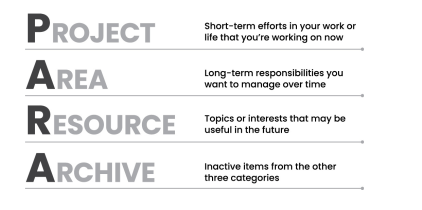

<!-- _paginate: skip -->
# **NODE Book Club**

## Building a Second Brain  
### *Tiago Forte*
---

## Introduction 
- We consume a lot of information.
  - But we can't remember it all.
- We all take notes, collect bookmarks, etc. 
  - But we don't use them well enough later.
<!-- We tried several apps but none of them really worked. -->
Because we don't have a system.

---
<!-- It's like a personal assistant -->
<!-- 4 essential capabilities are: -->
## The Second Brain
A second brain can:
- Make our ideas concrete.
<!-- Digital notes are not physical but they are visual. So they can be observed, rearranged, edited and combined together. -->
- Reveal new associations between ideas.
<!-- Keeping diverse kinds of material in one place increase the likelihood that we'll notice an unusual connection between them. -->
- Incubate our ideas over time.
<!-- We tend to favor the ideas, solutions, and influences that occurred to us most recently, regardless of whether they are the best ones. -->
<!-- Let us escape Recency bias -->
- Sharpen our unique perspectives.
<!-- Advocating a view requires data and notes you took can provide that. -->
---
Digital notes apps are suitable for building a second brain. Because they are:
- Multimedia 
<!-- You can add images, videos, audio, etc. -->
- Informal 
<!-- You can write/collect ideas in a free form -->
- Open ended
<!-- You can add as many notes as you want -->
- Action-oriented
<!-- Notes dont need to be prices or comprehensive. You can just capture whatever you have in mind -->
---
Paper notes also have these qualities. But **digitalisation makes them:**
- Searchable
- Easily editable
- Sharable
- Linkable
- Syncable
<!-- Check app options in buildingasecondbrain.com/resources -->
---
#### Three stages of Personal Knowledge Management
<!-- As people set out on their Second Brain journey, there are three stages of progress he often observe
and encourage -->
- Remembering
<!-- First, people use it as a memory aid: meeting notes, details of a project etc. -->
- Connecting
<!-- Secondly, they use it to connect ideas together. -->
- Creating
<!-- Finally, to create new things. Turn all resources collected to a project: book, youtube channel etc. -->
---
#### The **CODE** Method: The Four Steps to Remembering What Matters

<!-- He defines the method as: -->
<!-- CODE is a map for navigating the endless streams of information we are now
faced with every day. It is a modern approach to creating a commonplace book,
adapted to the needs of the Information Age. -->
---
## **Capture** - Keep What Resonates

> **Everything not saved will be lost.** 
>  *Nintendo “Quit Screen” message*

---
#### Creating a Knowledge Bank
- How can we decide what to save when we have no idea what the future holds?
- A knowledge asset is anything that can be used in the future to solve a problem, save time, illuminate a concept, or learn from past experience.
- Knowledge assets can come from either the external world or your inner thoughts.
---
#### External knowledge assets
- Highlights
- Bookmarks
- Voice Memo
- Meeting notes
- Images
---
#### Internal knowledge assets
<!-- As you start collecting this material from the outer world, it often sparks new
ideas and realizations in your inner world. You can capture those thoughts too! -->
- Insights
- Memories
- Reflections
<!-- The meaning of a thought, insight, or memory often isn’t immediately clear. We need to write them down, revisit them, and view them from a different perspective in order to digest what they mean to us. It is exceedingly difficult to do that within our heads. We need an external medium in which to see our ideas from another vantage point, and writing things down is the most effective and convenient one ever invented. -->
---
#### What **Not** To Keep
- Security sensitive information
- Special format files
<!-- Special format files that you cannot open in the app directly anyway -->
- Very large files
- Notes that require collaboration
---
### Capture Criteria
<!-- We should capture only the most valuable and relevant pieces of information. -->
- Does it inspire me?
<!-- Inspiring: It is the essential fuel for doing your best work, yet it’s impossible to call up inspiration on demand. You can Google the answer to a question, but you can’t Google a feeling. -->
- Is it useful?
<!-- Useful: Sometimes you come across a piece of information that isn’t necessarily inspiring, but you know it might come in handy in the future. A statistic, a reference, a research finding, or a helpful diagram -->
- Is it personal?
<!-- Personal: Your own thoughts, reflections, memories, and mementos are very valuable. We can use notetaking to document our lives and better understand how we became who we are. -->
- Is it surprising?
<!-- Surprising: People often take are of ideas they already know, already agree with, or could have guessed. That isn’t what a Second Brain is for. If you’re not surprised, then you already knew it at some level, so why take note of it?
Surprise is an excellent barometer for information that doesn’t fit neatly into our existing understanding, which means it has the potential to change how we think. -->
 
Ultimately, capture what **resonates!**
<!-- As you consume a piece of content, listen for an internal feeling of being moved or surprised by the idea you’re taking in. This special feeling of “resonance” is your intuition telling you that something is literally “noteworthy.” You don’t need to figure out exactly why it resonates.There’s scientific evidence that our intuition knows what it’s doing. -->

---
#### Beyond Your Notetaking App

<!-- How does capturing work exactly? -->
<!-- We can use our existing tools to capture ideas, then collect them in one main place: second brain. -->
<!-- Ebook apps: book highlights, notes  -->
<!-- Read later apps: bookmark content to read later and take notes etc. -->
<!-- Basic notes apps: quick notes -->
<!-- Social media apps: like, bookmark content-->
<!-- Web clippers: save parts of web pages -->
<!-- Transcriptions apps: audio/video transcription -->
---
### Your Turn: What Would Capturing Look Like If It Was Easy?
<!--It’s important to keep capturing relatively e ortless because it is only the first step. You need to do it enough that it becomes second nature, while conserving your time and energy for the later steps when the value of the ideas you’ve found can be fully unleashed.
Capture isn’t about doing more. It’s about taking notes on the experiences you’re already having. It’s about squeezing more juice out of the fruit of life,savoring every moment to the fullest by paying closer attention to the details.
Don’t worry about whether you’re capturing “correctly.” There’s no right way to do this, and therefore, no wrong way.-->
---
## **Organize** - Save for Actionability

> **Be regular and orderly in your life so that you may be violent and original in your work.** 
>  *Gustave Flaubert*
<!-- The next step in building your Second Brain is to take the pieces of insight you’ve begun to capture and organize them in a space where you can do your best thinking. -->
---
#### Organizing for Action
- People have tried different ways to organize their digital lives.
- But they all failed because they required too much time and effort.
- Why not just organize by project?
<!-- - If organizing by project is the most natural way to manage information with minimal e ort, why not make it the default? -->
---
### PARA Organization System

<!-- Projects at work: Complete web-page design; Create presentation for a conference; Develop project schedule;
Personal projects: Finish language course; Plan vacation; Buy new living room furniture;
Side projects: Publish blog post; Complete online course. -->
---
#### Areas: What I’m Committed to Over Time
<!-- As important as projects are, not everything is a project. -->
<!-- For example, the area of our lives called “Finances” doesn’t have a definite end date. It’s something that we will have to think about and manage, in one way or another, for as long as we live. It doesn’t have a final objective. -->

<!-- They can be either personal or work related -->
---
#### Resources: Things I Want to Reference in the Future
A catchall for anything that doesn’t belong to a project or an area.
<!-- You can also think of them as “research” or “reference materials.” They are trends you are keeping track of, ideas related to your job or industry, hobbies and side interests, and things you’re merely curious about. -->
- What topics are you interested in?
<!-- Topics: Architecture; Cinema; Cooking -->
- What subjects are you researching?
<!-- Subjects: Notetaking, Productivity, Project Management -->
- What useful information do you want to be able to reference?
<!-- To reference: Stock photos, github repos -->
- Which hobbies or passions do you have?
<!-- Hobbies: Photography, Gaming -->
---
#### Archives: Things I’ve Completed or Put on Hold
Any item from the previous three categories that is no longer active.
- Completed or cancelled projects
- Areas that you are no longer committed to
- Resources that are no longer relevant
---
#### How Does it Look Like?

Top level view

---

Projects view

---

Example project view
<!-- It's similar for areas and resources -->
---
#### Where Do I Put This?
<!-- How to decide where to save individual notes. -->
- **Seperate** capture and organize into two distinct steps
<!-- We usually are tempted to decide where to save a note as we capture it. But it adds a lot of friction to process, capturing should be quick and easy.-->
<!-- Most apps have inbox for not yet organized notes. -->
- Questions to ask yourself:
  1. In which project will this be most useful?
  2. If none: In which area will this be most useful?
  3. If none: Which resource does this belong to?
  4. If none: Place in archives.
  <!-- In other words, you are always trying to place a note or le not only where it will be useful, but where it will be useful the soonest. By placing a note in aproject folder, you ensure you’ll see it next time you work on that project.-->
---
### Your Turn: Move Quickly, Touch Lightly
<!-- My mentor advised me to “move quickly and touch lightly” instead. To look for the path of least resistance and make progress in short steps. I want to give the same advice to you: don’t make organizing your Second Brain into yet another heavy obligation. Ask yourself: “What is the smallest, easiest step I can take that moves me in the right direction?” -->
Start by creating project folders for your current projects.
- Notice what's on your mind
- Look at your calendar
- Look at your to-do list
- Look at your downloads, bookmarks, emails ...
<!-- And start capturing/organizing for these projects. -->
---
# Final Comments
**See you in part 2!**