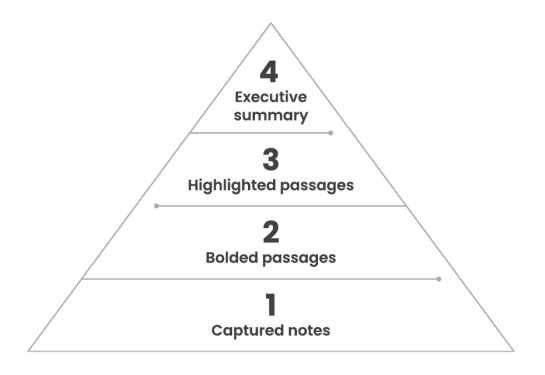

<!-- _paginate: skip -->
# **NODE Book Club**

## Building a Second Brain  
### *Tiago Forte*
---

#### The **CODE** Method: The Four Steps to Remembering What Matters

<!-- Where were we last time? -->
---
## **Distill** - Find The Essence

> **To attain knowledge, add things every day. To attain wisdom, remove things every day.** 
>  *Lao Tzu, ancient Chinese philosopher*

<!-- Until now, we captured notes and maybe even organized them. But what do we do with them?
This is where even the most dedicated notetakers usually stop. They aren’t
sure what to do next. They’ve gathered some interesting knowledge, but it hasn’t
led anywhere. Our notes are things to use, not just things to collect. -->
---

#### Discoverability
- Discoverability is the most important factor in whether your notes can survive that journey into the future.
- The more notes you collect, the less discoverable they become.
- **Highlighting** the most important points is a simple habit that enhances the discoverability of your notes.
---
#### **Highlighting 2.0:** Progressive Summarization
<!-- Progressive Summarization is the technique I teach to distill notes down to their most important points. -->
<!-- The technique is simple: you highlight the main points of a note, and then highlight the main points of those highlights, and so on, distilling the essence of a note in several “layers.” Each of these layers uses a di erent kind of formatting so you can easily tell them apart. -->

Four layers of Progressive Summarization
<!-- Executive summary is rarely needed: when you visit the note again and again -->
---
#### Most Common Mistakes
- Over-highlighting
<!-- A helpful rule of thumb is that each layer of highlighting should include no more than 10–20 percent of the previous layer. -->
- Highlighting without a purpose in mind
<!-- The most common question I hear about Progressive Summarization is “When should I be doing this highlighting?” The answer is that you should do it when you’re getting ready to create something. -->
- Making highlighting difficult
<!-- Rely on your intuition, do not overthink it. -->
---
### **Your Turn:** Keep Your Future Self in Mind
<!-- Make it easy to find and work with your notes in the future. -->
<!-- Start distilling your notes now -->

---
## **Express** - Show Your Work
> **We only know what we make** 
>  *Giambattista Vico, Italian philosopher*
<!-- The nal stage of the creative process, Express, is about refusing to wait until you have everything perfectly ready before you share what you know. It is about expressing your ideas earlier, more frequently, and in smaller chunks to test what works and gather feedback from others. That feedback in turn gets drawn in to your Second Brain, where it becomes the starting point for the next iteration of your work. -->
---
#### **Intermediate Packets:** The Power of Thinking Small
<!-- it’s not enough to simply divide tasks into smaller pieces—you then need a system for managing those pieces. Otherwise, you’re just creating a lot of extra work for yourself trying to keep track of them. -->
<!-- That system is your Second Brain, and the small pieces of work-in-process it contains I call “Intermediate Packets.” Intermediate Packets are the concrete, individual building blocks that make up your work.I For example, a set of notes from a team meeting, a list of relevant research ndings, a brainstorm with collaborators, a slide deck analyzing the market, or a list of action items from a conference call. Any note can potentially be used as an Intermediate Packet in some larger project or goal. -->
Five kinds of Intermediate Packets you can create and **reuse** in your work:
- Distilled notes
- Outtakes
- Work-in-process
- Final deliverables
- Documents created by others
---
#### Leverage Your Existing Creativity
- Everyday work creates reusable by-products (IP).
- **Save & organize** IPs in a Second Brain for easy reuse.
- **Assemble existing materials** instead of starting from scratch.
<!-- - Boost creativity, reduce stress, and save time. -->
<!-- Example: Planning a conference using saved agendas, emails, and templates. Organizing IPs prevents duplication and streamlines work. --> 
---
Retrieve saved ideas with four methods:
1. **Search** – Quickly find notes with keywords.
2. **Browsing** – Navigate folders for structured discovery.
3. **Tags** – Link related ideas across projects.
<!-- I don’t recommend using tags as your primary organizational system. It takes far too much energy to apply tags to every single note compared to the ease of searching with keywords or browsing your folders. However, tags can come in handy in specific situations when the two previous retrieval methods aren’t up to the task, and you want to spontaneously gather, connect, and synthesize groups of notes on the fly -->
4. **Serendipity** – Unexpected connections spark creativity.
<!-- First, while using the previous retrieval methods, it is a good idea to keep your focus a little broad. Don’t begin and end your search with only the specific folder that matches your criteria. Make sure to look through related categories, such as similar projects, relevant areas, and different kinds of resources. -->
<!-- Second, serendipity is amplified by visual patterns. This is why I strongly suggest saving not only text notes but images as well (which is difficult to do in other kinds of software such as word processors). -->
---
### **Everything is a Remix**
Creativity is about reusing and recombining ideas to build something new.
<!-- Creativity doesn’t happen in isolation—it’s a remix of past ideas, experiences, and influences. -->
<!-- By saving and organizing Intermediate Packets, we build assets that can be recombined instead of starting from scratch. -->
<!-- The more we document and structure our knowledge, the easier it becomes to remix ideas into something original. -->
---
### **Your Turn:** You Only Know What You Make

Create to truly understand. Express ideas, test knowledge, and share your work to unlock your full potential.

---
# **Final Words**
**See you in the next part!**