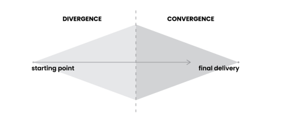

<!-- _paginate: skip -->
# **NODE Book Club**

## Building a Second Brain  
### *Tiago Forte*
---
## The Art of Creative Execution
> Creative products are always shiny and new; **the creative process is ancient and unchanging.**

---
### Why It Matters
- Value your ideas—they can change lives
- Smallest ideas have big potential
- Start small, prove your impact

---
### The Creative Process

- **Divergence**: Open up—explore every option wildly  
- **Convergence**: Narrow down—focus and finish strong  
<!-- Creativity has two phases. Divergence is when you go wild—chase every random thought, collect whatever catches your eye. That’s Capture and Organize. Then there’s Convergence—you zoom in, pick what matters, and get it done. That’s Distill and Express. You keep bouncing between them to make your thing better each time." -->
---

### Struggles with Convergence
- Hard to narrow options
- Temptation to research more
- Creative grief in cutting ideas
<!-- Here’s where it gets tricky: switching to convergence is hard. If you’re imaginative or curious, you might resist cutting options. And it’s so tempting to keep researching because it feels productive. But Forte calls this ‘creative grief’—letting go of ideas is painful, yet it’s what lets you finish and share something meaningful. -->

---
### Strategies for Completion
1. **Archipelago of Ideas**: Gather, then link key points  
2. **Hemingway Bridge**: Stop when you know the next step  
3. **Dial Down the Scope**: Ship small, then iterate
<!-- <!-- Archipelago of Ideas: seperate "choosing ideas" and "arrangement". -->
 <!-- Second, use the Hemingway Bridge: Write down ideas for next step, current status etc.-->
 <!-- Third, start a feedback loop—share early drafts to get input. Your Second Brain keeps all this safe and workable -->
---
### **Your Turn:** Move Fast and Make Things
<!-- 
- Pick one project to start  
- Make an outline: goals, questions, notes  
- Gather from PARA, no new research  
- Set a timer (15-20 mins), draft something  
- Share it, get feedback, keep notes, iterate -->
---
## The Essential Habits of Digital Organizers
> It’s only **by making the fundamentals of life easier** that you can create the mental space needed for free thinking and creativity.

---
### Productivity Meets Creativity
- Second Brain boosts both  
- Order clears space for ideas  
- Confidence cuts stress
<!-- Second Brain isn’t just about getting stuff done—it’s about being creative too. People think those two don’t mix, like productivity’s all strict and creativity’s this free-for-all, but they actually work together. When you’ve got things organized, it’s like clearing a space where ideas can pop up without you stressing about losing them. And when you trust your process, you don’t waste energy worrying if you’re on track—it just flows. -->
---
### Mise-en-Place for Knowledge
- Chefs stay organized in the flow  
- **Small habits** keep things ready  
- Handle chaos without stopping
<!-- "Think about chefs in a busy kitchen—they’ve got this thing called mise-en-place. It’s how they keep everything together while cranking out awesome food fast. They don’t stop to clean up—they’ve got habits like putting the spoon back in the same spot or wiping the knife right after using it. We’re the same as knowledge workers—tons of stuff coming at us. Little habits like that keep our digital space ready so we can focus on the good stuff." -->
---
### Three Key Habits
- **Checklists**: Start and finish projects smart  
- **Reviews**: Weekly reset, monthly rethink  
- **Noticing**: Tweak notes as you go
<!-- Here’s how to make it work: three simple habits. First, use checklists to kick off and wrap up projects. Second, do reviews—weekly ones to reset your head(clear emails, check calendar), monthly ones to look at the big picture(goals, prioritization) and tweak what’s off. Third, noticing—just spot little chances to fix a note’s title or move it somewhere useful while you’re working. -->
---
### **Your Turn:** A Perfect System You Don’t Use Isn’t Perfect
<!-- Notice your patterns, try to come up with a system that works for you -->
---
## The Path of Self-Expression
> **An idea wants to be shared.** And, in the sharing, it becomes more complex, more interesting, and more likely to work for more people.
> *adrienne maree brown, writer and activist*
---
### From Scarcity to Abundance
- Old world: info was rare  
- Now: too much, need to filter  
- Trust your Second Brain, free your mind
<!--In earlier times finding good info was tough—it was stuck in old books or smart people’s heads.But now? knowledge is in everywhere. The trick isn’t grabbing more; it’s figuring out how to shut off the flood and actually do something with what we’ve got. That starts with ditching the old idea that we need to hoard it all and trusting there’s enough out there already -->
---
### Mindset Over Toolset
- How you think matters most, not tools
- Second Brain frees your head  
- More calm, more ideas
<!-- So, this book’s been about picking up new tricks for handling info, but here’s the real deal: it’s not the apps or tools holding you back—it’s how you think. I’ve seen it tons of times—people stress out chasing the perfect setup, but it’s your headspace that matters. When you start using a Second Brain, it’s like your brain sighs in relief—everything’s tracked, so you chill out and focus. You stop feeling like you’re drowning in info and start seeing it as this big, helpful pile you can dip into whenever. That’s the game-changer. -->

---
### Create, Don’t Just Collect
- Knowledge grows when shared  
- Find what’s inside you  
- Use it to help others
<!-- building a Second Brain isn’t just about stacking up facts—it’s about making something out of them. Knowledge isn’t meant to sit there; it gets better when you share it. So you’re not just collecting; you’re digging into what you know and using it to help people out. That’s when it really starts to mean something.  -->
---
## Final Thoughts: **You Can Do This!**
- Choose your notes app
- Set up **PARA**: Projects, Areas, Resources, Archives
- Use **CODE**: Capture, Organize, Distill, Express  
- Tweak it your way, keep it flexible
- Create, share, and grow