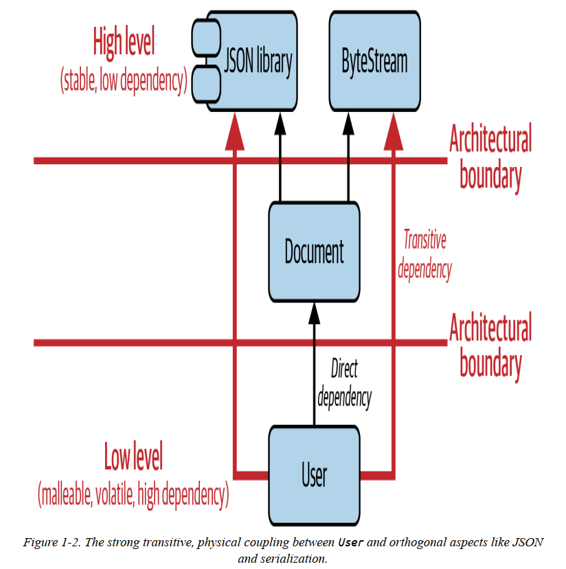
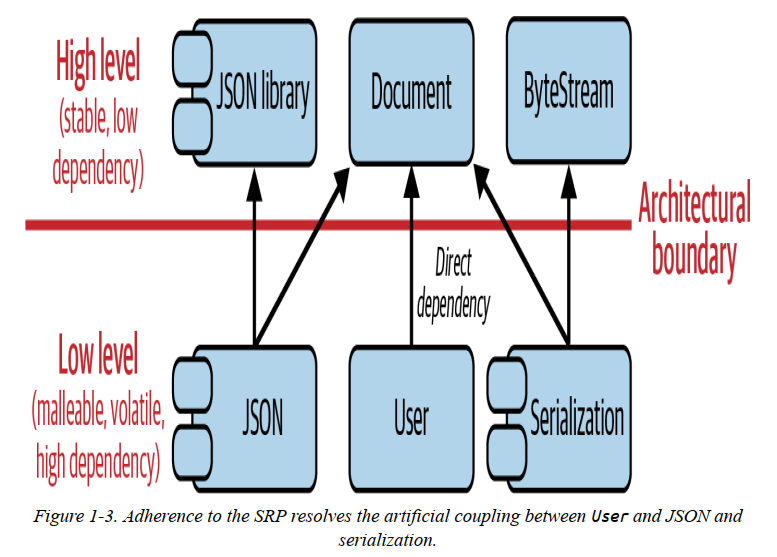
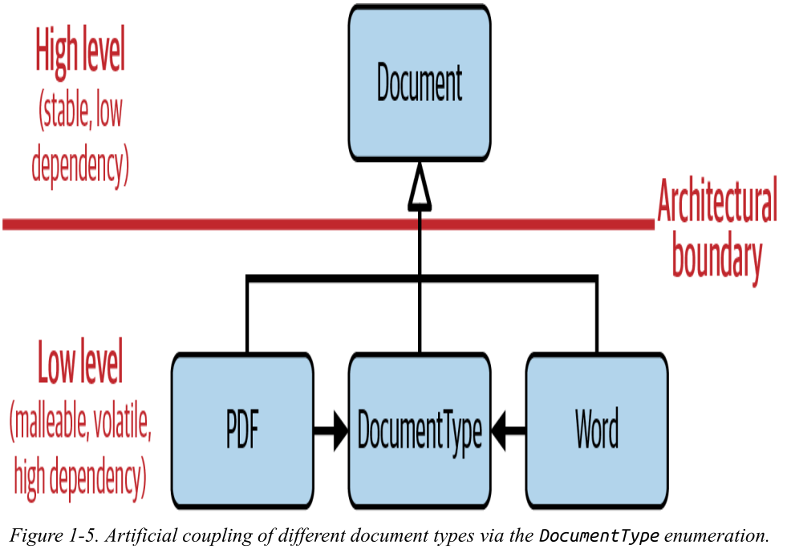
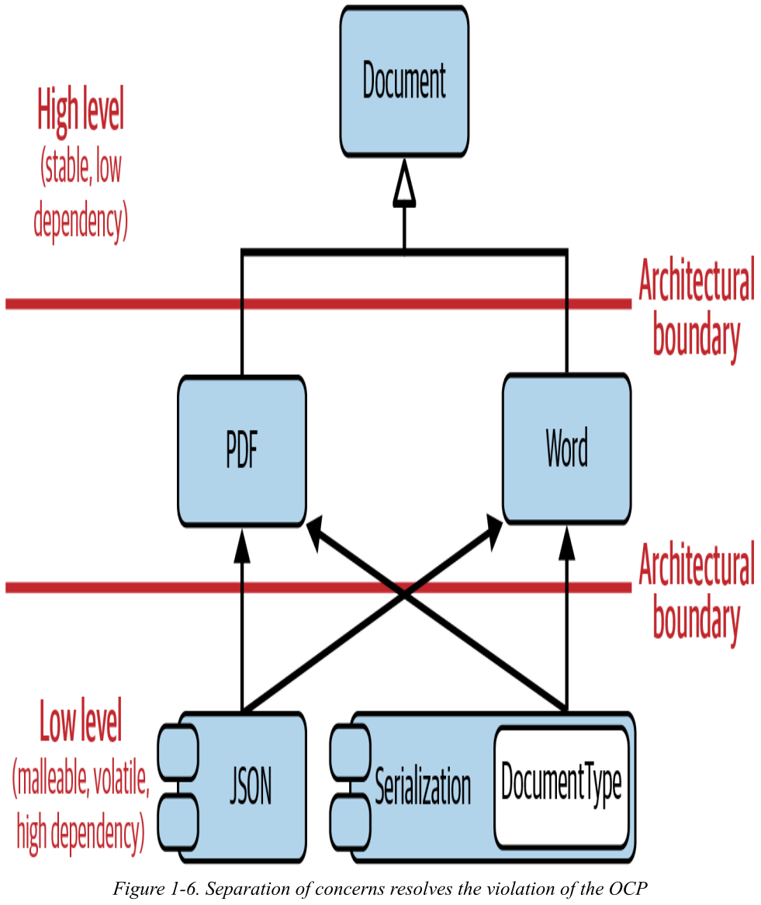
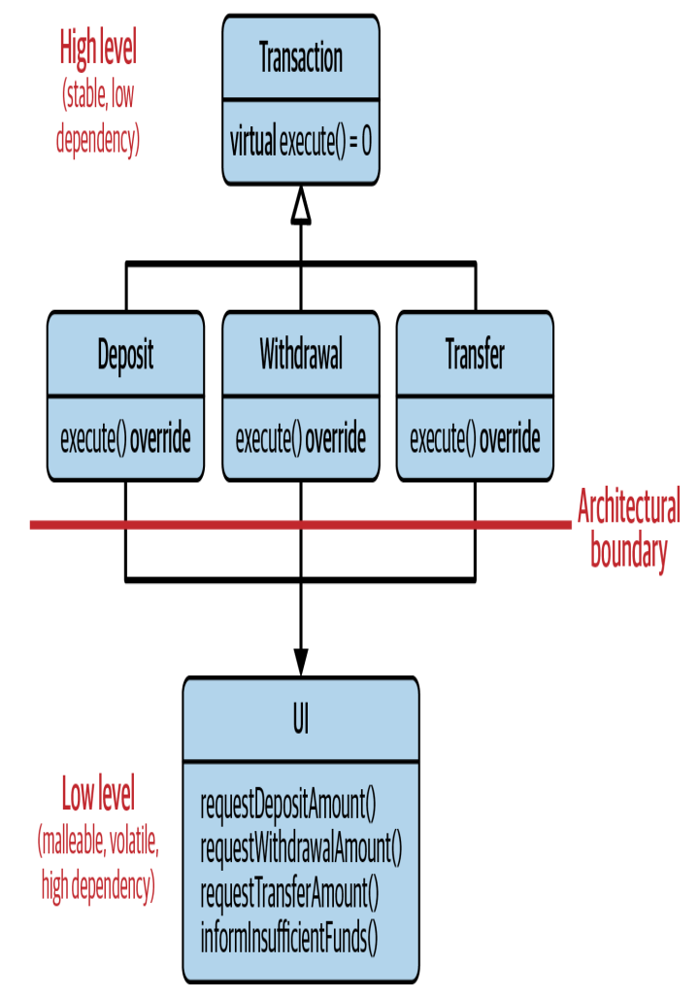
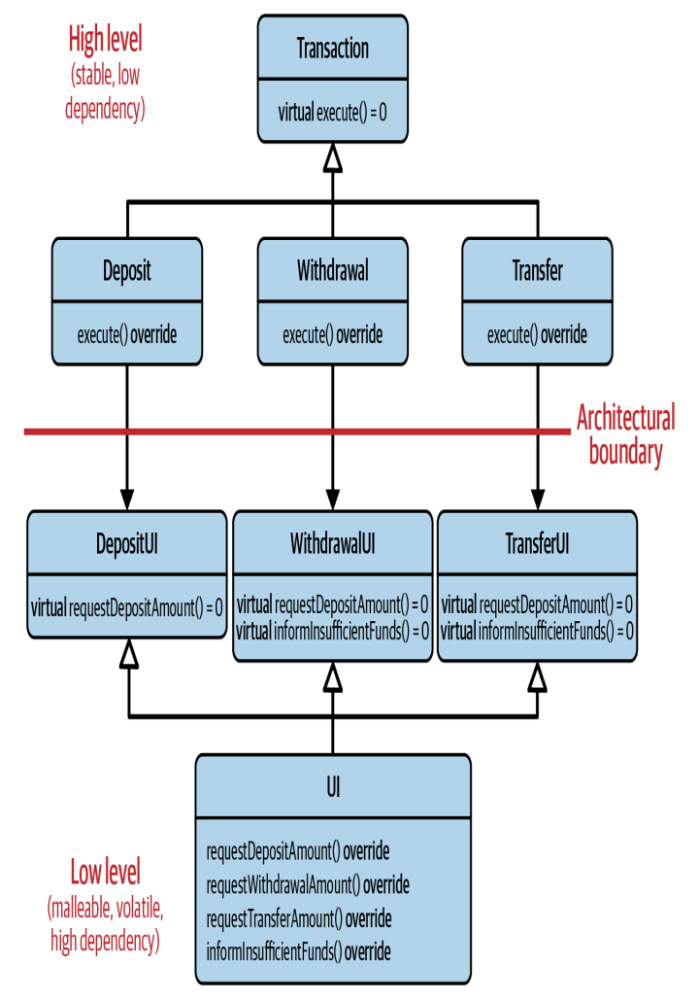
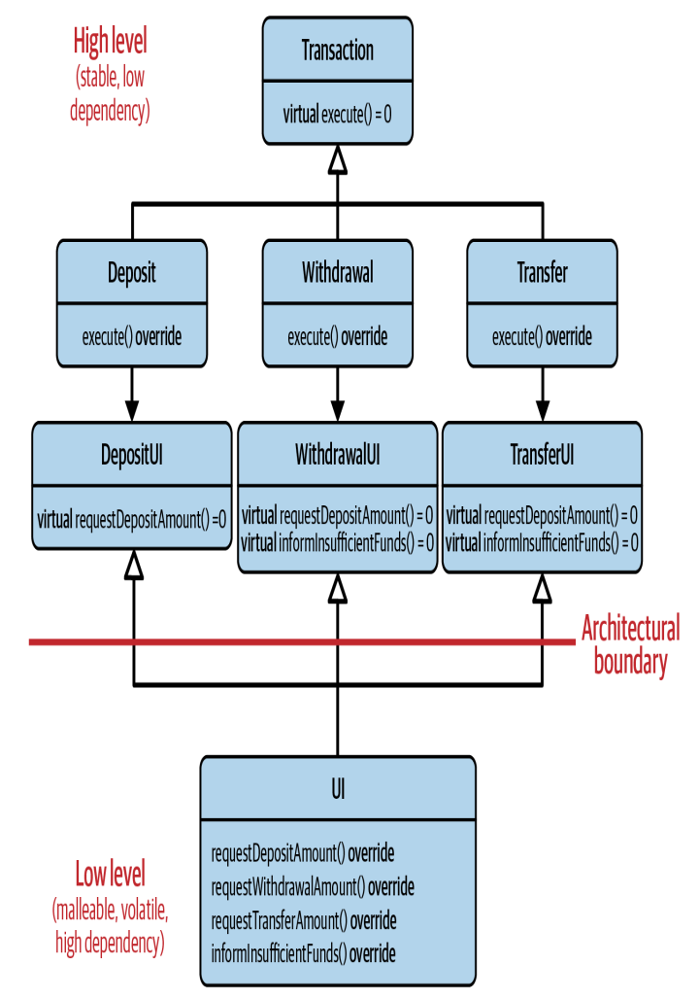

<!-- _paginate: skip -->
# **NODE Technical Book Club**

## C++ Software Design - Klaus Iglberger
<!-- 
Third book of the club.
My thoughts...
ASK: Could you read it? Did you like? Any initial comments?
-->
---
### G1: Understand the Importance of Software Design
- Software design is the essential part of software development.
- Language features are just tools, the design is what makes the difference.
<!-- People wrongly focus on the features a lot. -->
- Dependency is the key problem, and the design is the art of managing dependencies and abstractions.
---
### G2: Design For Change
- Changes in software are inevitable so design for easy change.
<!-- Philosophy of software design book also mention this as one of two biggest problems: Change amplifiation -->
- Two principles:
    - Adhere to **Single Responsibility Principle (SRP)** to separate concerns.
    - Follow the **Don't Repeat Yourself (DRY)** principle to minimize duplication.
---
### Separation of Concerns
- **Single Responsibility (SRP):** A class should have only one reason to change.
- Group only those things that truly belong together, and separate those that don't.
- **Example:** A document class with serialize and ExportToJson methods.
---


<!-- To summarize, deriving classes and users of documents may change for any of the following reasons:
- The implementation details of the exportToJSON() function change
because of a direct dependency on the used JSON library
- The signature of the exportToJSON() function changes because the
underlying implementation changes
- The Document class and the serialize() function change because of
a direct dependency on the ByteStream class
- The implementation details of the serialize() function change
because of a direct dependency on the implementation details
- All types of documents change because of the direct dependency on
the DocumentType enumeration -->
---

<!-- Now the Document class only represents basic operations for each document.  -->
<!-- All orthogonal concerns are separated into different classes. -->
---
### Don't Repeat Yourself
<!-- - Repetition creates change amplification. -->
- Do not duplicate some key information in many places.
- Design the system such that **we can make the change in only one place**. 
<!-- In the optimal case, the tax rate(s) should be represented in exactly one place to enable you to make an easy change. -->
- **Example:** Tax calculation in different item types.
---
### G3: Seperate Interface to Avoid Artificial Coupling
- **Interface segregation principle(ISP):** Clients should not be forced to depend on interfaces they do not use.
- **Example:** `Document` class have both exportToJSON and serialize methods. `exportDocument` method only uses `exportToJSON` method but still also depends on `serialize` method.
<!-- Also applicable to templates -> std::copy iterator example -->
---
Refactor to:
```cpp
class Document
: public JSONExportable
, public Serializable
{
    public:
    // ...
};
```
and 
```cpp
void exportDocument( JSONExportable const& exportable )
{
    exportable.exportToJSON();
}
```
---
### G4: Design for Testability
- Software is constantly changing and test are the safety net.
- Design the software such that it is testable, even **easily testable** in the best case.

---
```cpp
class Widget
{
    public:
        // ...
    private:
     void updateCollection( /* some arguments needed to update the collection */
    );

    std::vector<Blob> blobs_;
    /* Potentially other data members */
};
```
**Challenge**: How would you test `updateCollection`?

---
#### Possible Solutions:
* Test the public methods where `updateCollection` is called.
<!-- White-box testing: Avoid if possible? Creates dependency of the test code on implementation details -->
* Making test friend of the class.
<!-- Friend: production code knows about test -> cyclic dependency -->
* Make it protected and derive a test class.
<!-- Protected: Not much different than public -->
<!-- Inheritance is rarely the answer -->
---
#### The True Solution: Separate Concerns
- Extract the private method into a separate class or free function.
<!-- ASK: Doesn't that seperating thing that belong together? -->
<!-- ASK: Then shouldn't we have private methods at all? -->
<!-- Probably shouldn't be private if it needs to be tested in isolation -->
```cpp
class BlobCollection
{
public:
    void updateCollection( /* some arguments needed to update the collection */);
private:
    std::vector<Blob> blobs_;
};
```
---
### G5: Design for Extension
- Software always evolves and grows, so it should be easy to extend.
- **Open-Closed Principle (OCP):** Software entities should be open for extension but closed for modification.
---

<!-- - DocumentType enum couples all the types together. -->
<!-- - Adding a new type requires recompling all the types. -->
---

<!-- - Serialization depends on the types, not the other way around. -->
<!-- Arrows go from low level to high level as desired -->
---
### Compile-Time Extensibility
- The Standard Library is designed for extensibity. But it builds on function overloading, templates, and (class) template specialization instead of inheritance.
- **Example:** `std::swap`
    - It is a template function so can be used with any type.
    - It can be specialized if needed.
---
<!-- - Second Chapter: The Art of Building Abstractions -->
### G6: Adhere to the Expected Behavior of Abstractions
- The classical example: Is square a rectangle?
    * Geometrically, yes.
    * But in software, no.
<div data-marpit-fragment>

```cpp
void transform( Rectangle& rectangle) {
    rectangle.setWidth ( 7 );
    rectangle.setHeight( 4 );
    assert( rectangle.getArea() == 28 ); 
    // ...
```
</div>

---
- **Liskov Substitution Principle (LSP):** Expectations in an abstraction, must be adhered to in a subtype.
- Preconditions cannot be strengthened in a subtype.
<!-- Precondition: i>0 -> i>10 -->
- Postconditions cannot be weakened in a subtype.
<!-- Postcondition: Return i>0 -> Return negative values -->
- Function return types in a subtype must be covariant.
<!-- Return type: base class -> derived class -->
- Function parameters in a subtype must be contravariant.
<!-- Parameter type: derived class -> base class -->
- Invariants of the supertype must be preserved in a subtype.
<!-- Invariant: only positive protected member -> set to negative -->
---
### G7: Understand the Similarities Between Base Classes and Concepts
- LSP is not limited to dynamic polymorphism and inheritance.
- Also can be applied to compile-time polymorphism and templates.
- Adhere to the expected behavior of concepts when using templates.
<!-- ASK: A short guideline for me, would someone like to add something? -->
---
### G8: Understand the Semantic Requirements of Overload Sets
- Every abstraction represents a set of semantic requirements.
<!-- - In other words, abstraction expresses expected behavior which needs to be fulfilled. -->
- Free functions represent a compile-time abstraction.
- Free functions perfectly live up to the OCP.
    - Easy to extend by adding new functions without modifying existing ones.
---
```cpp
template<typename Range>
void traverseRange(Range const& range)
{
    for(auto pos=range.begin(); pos!=range.end(); ++pos) {
    // ...
    }
}
```

vs.
```cpp
template<typename Range>
void traverseRange(Range const& range)
{
    for(auto pos=std::begin(range); pos!=std::end(range); ++pos) {
    // ...
    }
}
```
<!-- First one is limited to ranges with begin and end, but any type can have free begin and end functions -->
<!-- Free functions are also better for testability -->
---
#### STL Philosophy
- Loose coupling and reuse by separating concerns as free functions is one part of the STL philosophy.
- Containers and algorithms are two separate concepts within the STL.
- The abstraction between them is accomplished via iterators.
> There was never any question that the STL represented a breakthrough in efficient and extensible design.
<!-- Quote from Scott Meyers -->
---
### The Problem of Free Functions: Expectations on the Behavior
- It is not guaranteed that the special implementation of a free function adheres to the expected behavior.
- It may not always be clear what the expected behavior is.
- We need to be careful and pay attention to existing conventions.
---
### G9: Pay Attention to the Ownership of Abstractions
- **Dependency Inverson Principle (DIP):** You should depend on abstractions, not on concretions.
<!-- Concretions: Concrete types or implementation details -->
- In class diagrams, dependency arrows should be from low-level to high-level modules.
---

<!-- Transactions(High level) depend on UI(Low level) -->
<!-- In case of new transaction, need to update UI. Then all transactions needs recompile -->
---

<!-- Introduced UI subclasses -->
<!-- Now they will not need recompile -->
<!-- Achieved (local) DIP, ISP, SRP -->
<!-- But we still have a dependency from high level to low level -->
---

<!-- moved ownership of UI subclasses to transactions library -->
---
### G10: Consider Creating an Architectural Document
<!-- - Agile is actually about getting quick feedback not making quick changes. -->
<!-- - Abilitiy to quickly change is only possible with a good design and architecture. -->
> In most successful software projects, the expert developers working on that project have a shared understanding of the system design. This shared understanding is called ‘architecture.’
- Architectural document is needed to maintain and communicate the architecture.
---
# Final Comments?
**See you in part 2!**