<!-- _paginate: skip -->
# **NODE Technical Book Club**

## C++ Software Design - Klaus Iglberger
<!-- 
ASK: Could you read it? Did you like? Any initial comments?
-->
---
### G11: Understand the Purpose of Design Patterns
A design pattern:
- Has a name.
<!-- Name: Makes it easier to talk about the solution you have in your mind  -->
- Carries an intent.
<!-- Intent: I want to be able to easily add new types etc. -->
- Introduces an abstraction.
<!-- Abstraction: They provide some way to reduce dependencies by introducing some kind of abstraction -->
- Has been proven.
<!-- Proven: Used extensively and proven over years -->
---

**Example conversation:**
- **ME:** I would use a Visitor for that.
- **YOU:** I don’t know. I thought of using a Strategy.
- **ME:** Yes, you may have a point there. But since we’ll have to extend operations fairly often, we probably should consider a Decorator as well.

<!-- - The conversation is much easier with design patterns. Otherwise you would need to explain your intent and solution you suggested in detail.-->
---

### G12: Beware of Design Pattern Misconceptions
Design patterns are **not**:
- A goal
<!-- Not a goal but a means to achieve the goal. Use them wisely -->
- About implementation details
<!-- Example: Same pattern can be implemented with OOP and template metaprogramming. -->
- Limited to object-oriented programming
- Outdated or obsolete
---
### G13: Design Patterns are Everywhere
- Response to the misconception that design patterns are outdated or obsolete.
- They are everywhere, any kind of abstraction and any attempt to decouple likely represents a design pattern.
- Example: STL is full of design patterns.
---
### G14: Use a Design Pattern's Name to Communicate Intent
From:
```cpp
template< class InputIt, class T, class BinaryOperation >
constexpr T accumulate( InputIt first, InputIt last, T init,
BinaryOperation op );
```
<!-- BinaryOperation doesn't communicate intent of the parameter -->
To:
```cpp
template< class InputIt, class T, class BinaryReductionStrategy >
constexpr T accumulate( InputIt first, InputIt last, T init,
BinaryReductionStrategy op );
```
<!-- Both the term Reduction and the name Strategy carry meaning for every -->
<!-- C++ programmer. Therefore, you’ve now captured and expressed your -->
<!-- intent much more clearly: the parameter enables dependency injection of a -->
<!-- binary operation, which allows you to specify how the reduction operation -->
<!-- works. -->
---
<!-- Chapter 4 is on the Visitor Design Pattern -->
### G15: Design For the Addition of Types or Operations
- Design choice in dynamic polymorphism: Do you want to extend the ypes or the operations?
---
#### A Procedural Solution
```cpp
void drawAllShapes(std::vector<std::unique_ptr<Shape>> const& shapes)
{
	for(auto const& shape: shapes)
	{
		switch(shape->getType())
		{
			case circle:
				draw(static_cast<Circle const&>(*shape));
				break;
			case square:
				draw(static_cast<Square const&>(*shape));
				break;
		}
	}
}
```
<!-- We have base Shape class and derived Square and Circle. And free draw functions for them -->
<!-- ASK: What are the design problems here? -->
<!-- ShapeType enum -> couple all shapes -->
<!-- Adding new shape requires changing all the functions (add switch case) -->
---
#### An Object-Oriented Solution
```cpp
void drawAllShapes(std::vector<std::unique_ptr<Shape>> const& shapes)
{
	for(auto const& shape: shapes)
	{
		shape->draw();
	}
}
```
<!-- Now we have pure virtual draw method in the base class -->
<!-- Now it is easy to add new shapes -->
<!-- ASK: What is the disadvantage now? -->
<!-- But now we need to change all the shapes when we add a new operation -->
---
### G16: Use Visitor to Extend Operations
- In OOP solution, every new operation requires adding a new virtual function to the base class. But:
		- It is not always possible.
		- Need to know how to implement it for all shapes.
So if you want to extend operations, use the **Visitor** design pattern.
---
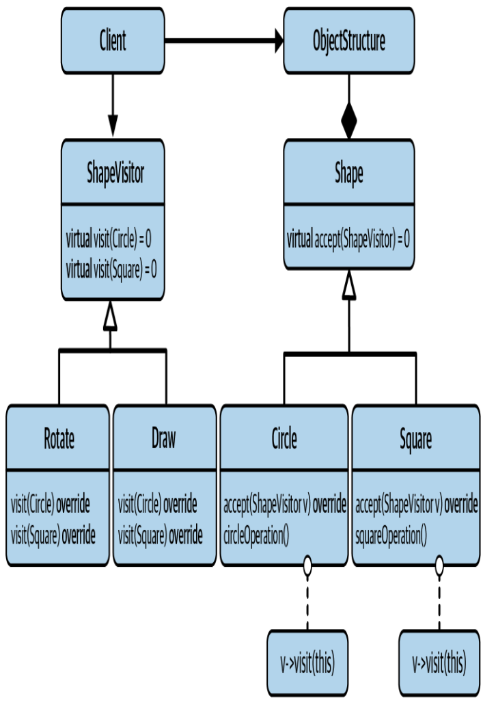
<!-- Now we have additional ShapeVisitor Base class -->
<!-- Now it is easy to add new operations, you don't need to change the shapes at all -->
<!-- accept is just v.visit(*this); -->
---
```cpp
void drawAllShapes(std::vector<std::unique_ptr<Shape>> const& shapes)
{
	for(auto const& shape: shapes)
	{
		shape->accept(Draw{});
	}
}
```

---
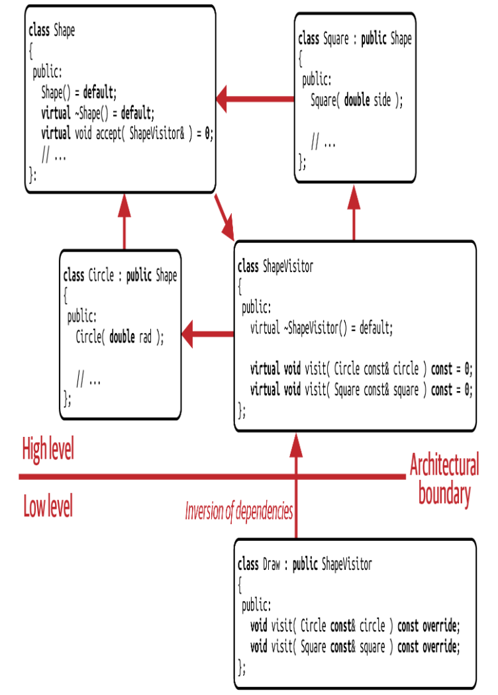
<!-- There is a cyclic dependency between ShapeVisitor and shapes -->
<!-- Adding new type requires to update shapevisitor so all visitors and shapes -->
---
#### Shortcomings of the Visitor Pattern
- Low implementation flexibility
<!-- Example: Translate is same for all but you still need to add it to all -->
- Intrusive nature
<!-- Intrusive: you need to add virtual accept to base class -->
- Low performance
<!-- Performance: For every operation we need to call two virtual functions. 	Double dispatching is not efficient -->
---
### G17: Consider std::variant for Implementing Visitor
```cpp
using Shape = std::variant<Circle, Square>;

struct Draw
{
	void operator()(Circle const& circle) const;
	void operator()(Square const& square) const;
};
```

```cpp
void drawAllShapes(std::vector<Shape> const& shapes)
{
	for(auto const& shape: shapes)
	{
		std::visit(Draw{}, shape);
	}
}
```
<!-- No more virtual functions -->
<!-- No more need for pointers to store shapes -->
---
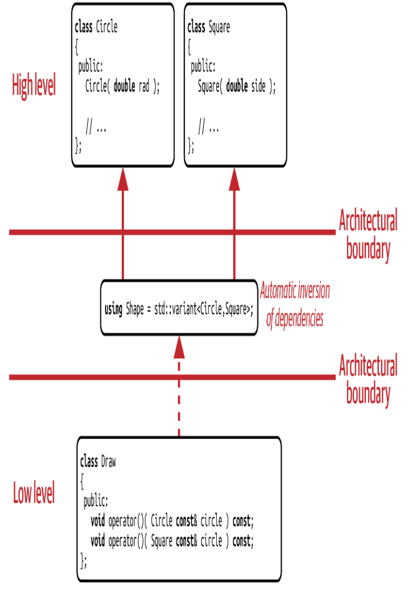
<!-- No cyclic dependency -->
<!-- Adding new type requires updating the variant and the visitor but not shapes-->
---
### G18: Beware the Performance of Acyclic Visitor
- Technically it is possible to support both an open set of types and an open set of operations using the **Acyclic Visitor**, but it is impractical.

---
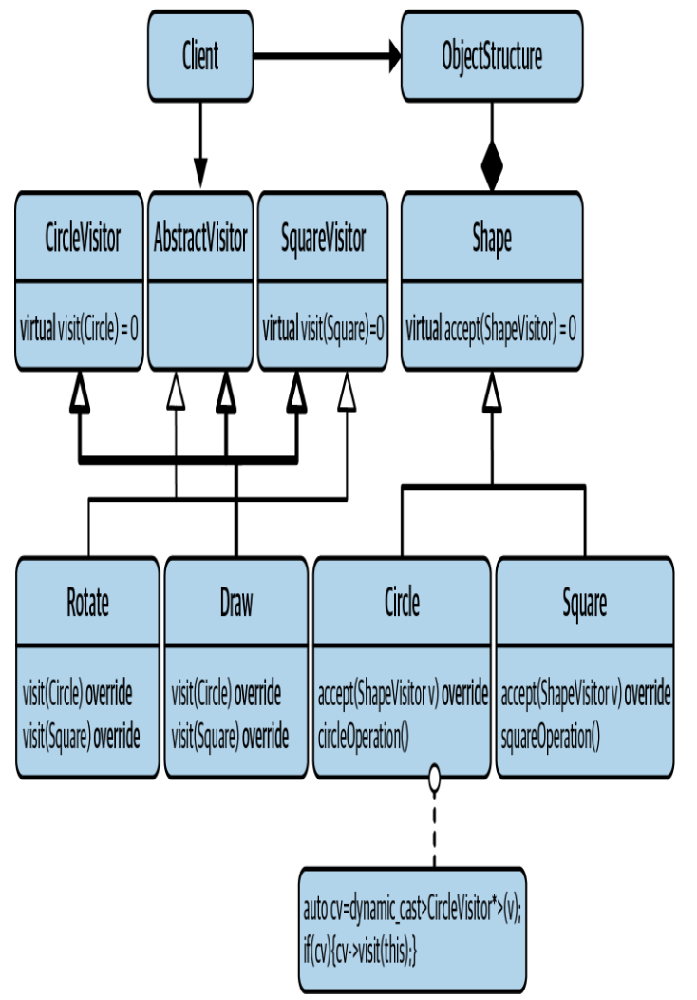
<!-- ShapeVisitor is split into AbstractVisitor and one visitor for each shape. -->
<!-- Operations can choose to support only some types by not inheriting from the others. -->

---
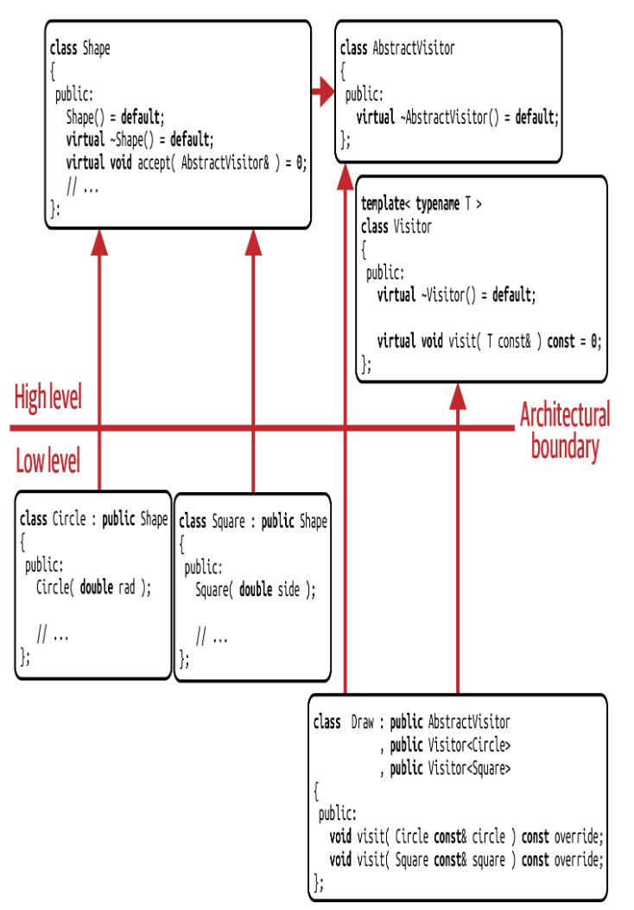

---
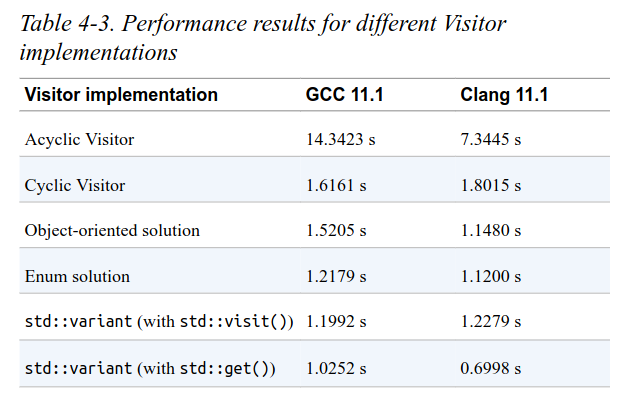

---
### G19: Use Strategy to Isolate How Things are Done
Intent of the Strategy pattern: Define a family of algorithms, encapsulate each one, and make them interchangeable. Strategy lets the algorithm vary independently from clients that use it.

---
Example: Shapes with draw methods
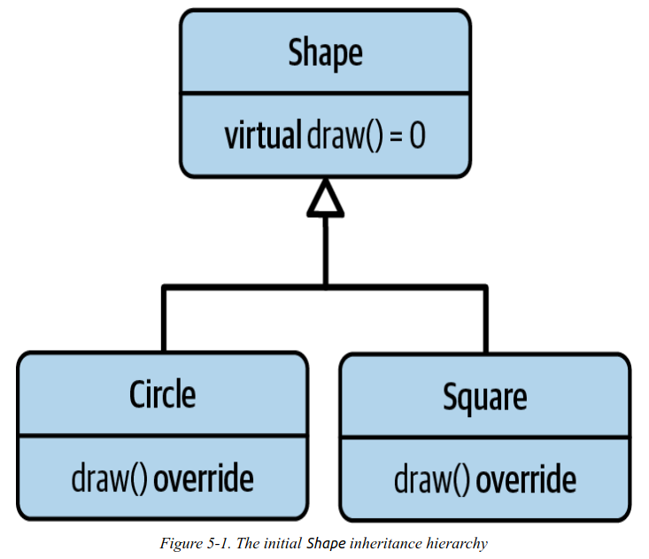
Initial Design: What is the problem here?
<!-- It's easy to add new types -->
<!-- It's not designed for change -->
<!-- Only one draw operation is supported -->
<!-- Shape depends on draw library (opengl) etc. -->
---
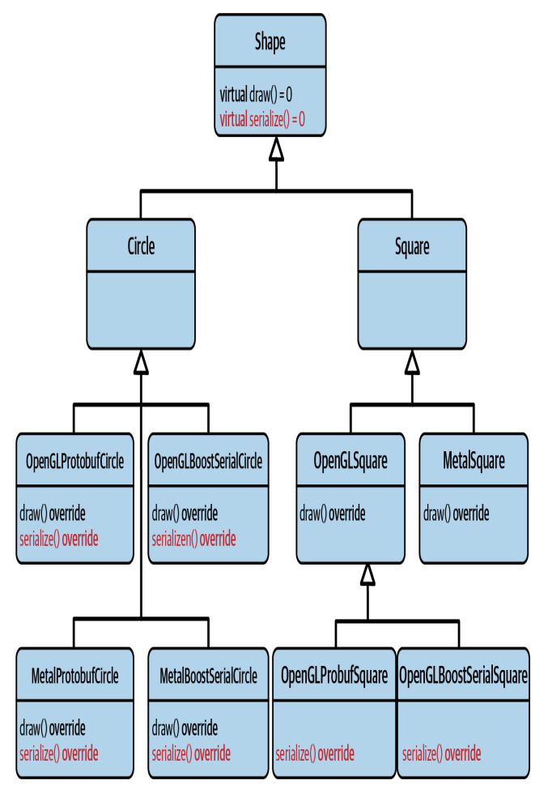
<!-- To be able to make it support more draw methods we can add more inheritance, but this is also not nice -->
<!-- SRP violation: Serialization and draw -->
---
Let's add strategy pattern to the design.
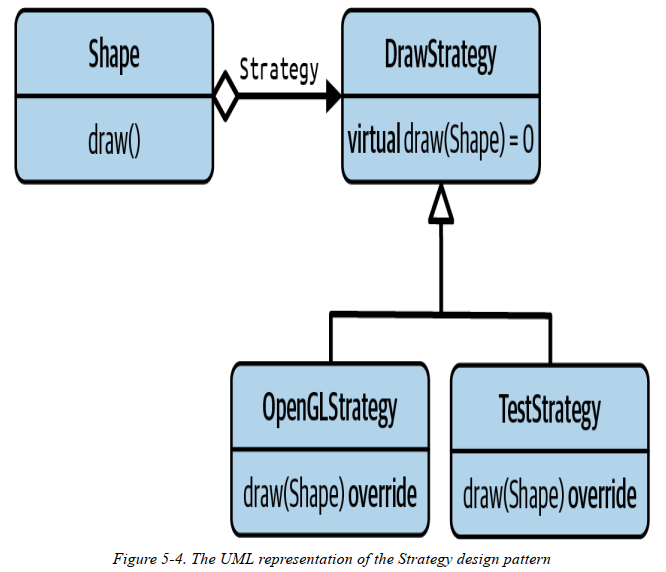

<!-- Shapes have unique_ptr<DrawStrategy> now. Dependency Injection -->
- **Naive Solution**: It is not easy to add new types.
<!-- All shapes are coupled in the DrawStrategy. -->
<!-- New Type -> Update Strategy -> Compile All shapes -->
---
We need to extract the implementation details of each shape separately.
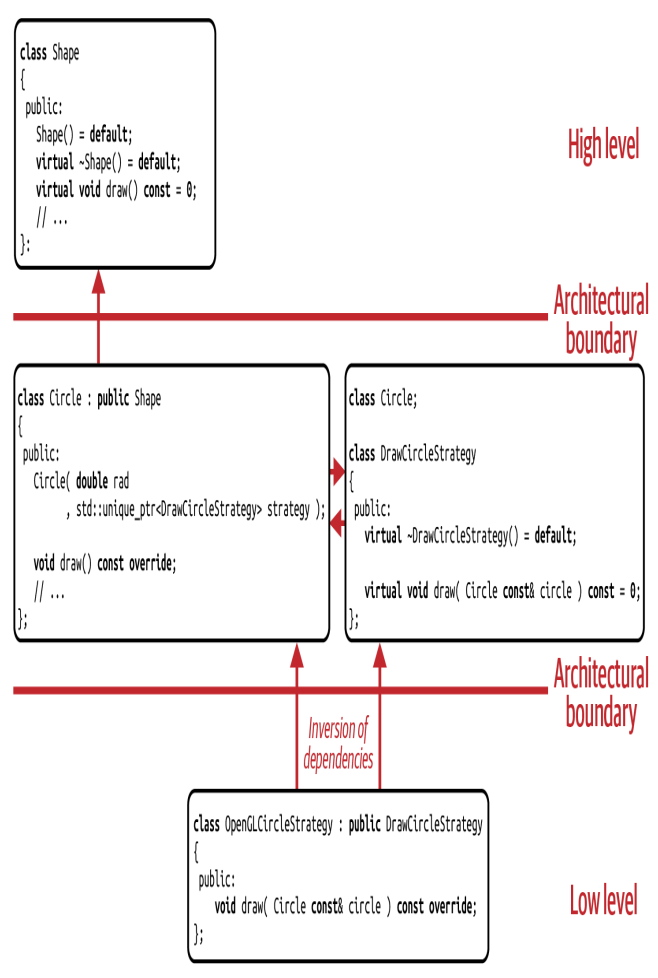

---
We can use templates to reuse code.
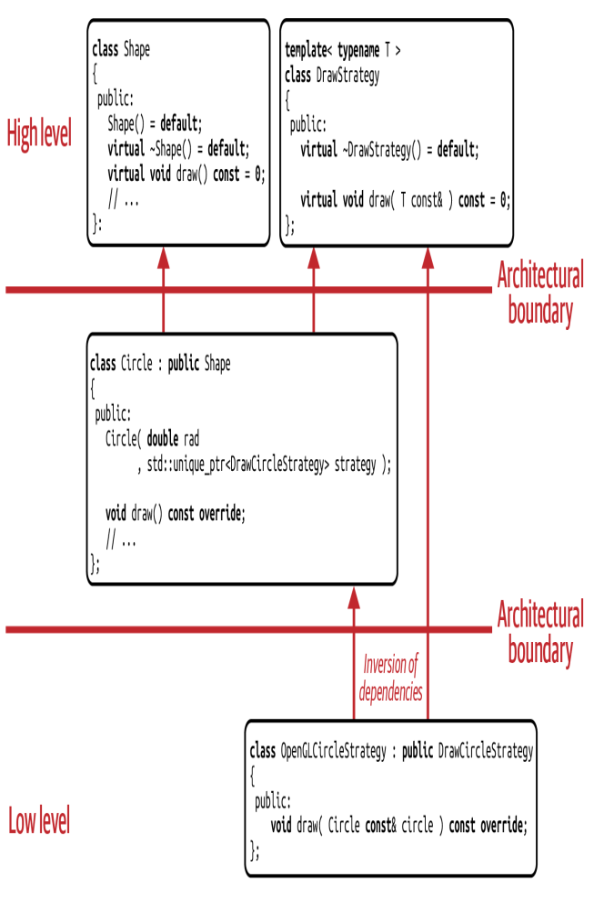

---
#### Visitor vs. Strategy
- **Visitor**: Addition of operations as varation point. Easy to add new operations but hard to add new types.
- **Strategy**: Implementation details of a single function as variation point. Easy to add new types but hard to add new operations.
---
#### Policy-Based Design
```cpp
template<typename ForwardIt, typename UnaryPredicate> 
constexpr ForwardIt
partition(ForwardIt first, ForwardIt last, UnaryPredicate p);

template<typename RandomIt, typename Compare> 
constexpr void 
sort(RandomIt first, RandomIt last, Compare comp                                                                );
```
- Both make use of the **Strategy** pattern.
- They allow the user to inject a part of the behavior from the outside.
- This is called **Policy-Based Design**.
<!-- It can be considered static polymorphism form of the Strategy pattern. -->
<!-- Instead of passing unique_ptr<DrawCircleStrategy> to Circle, we can specify Strategy as a template parameter. Fewer pointer indirections -->
---
# Final Comments?
**See you in part 3!**