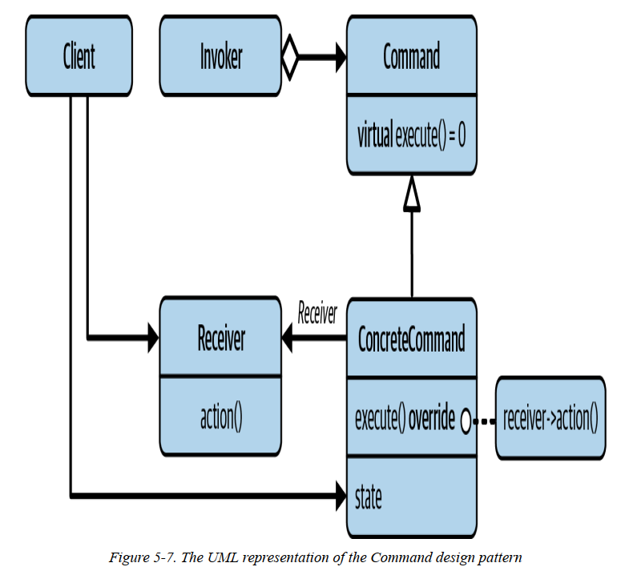
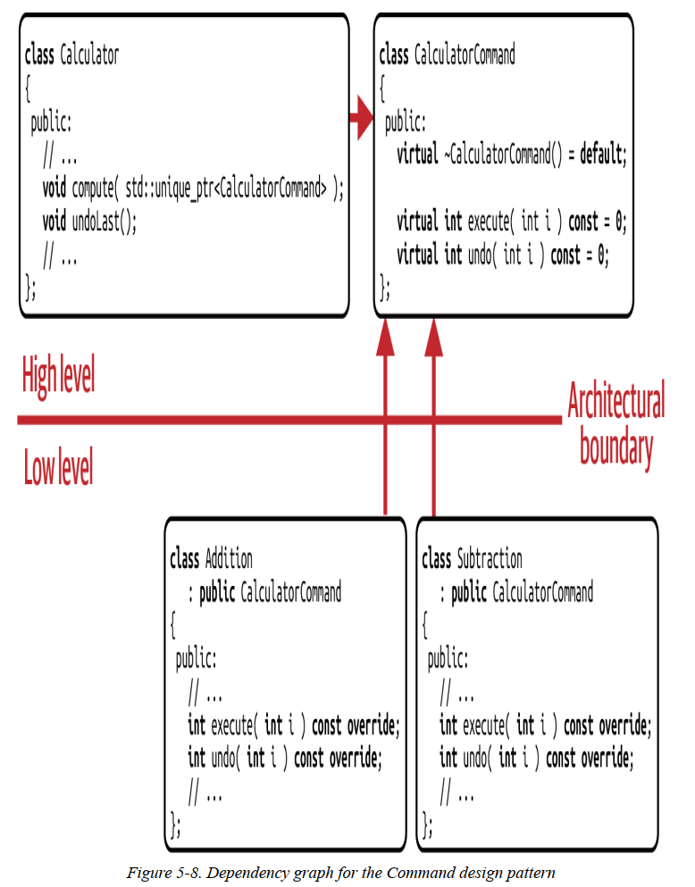
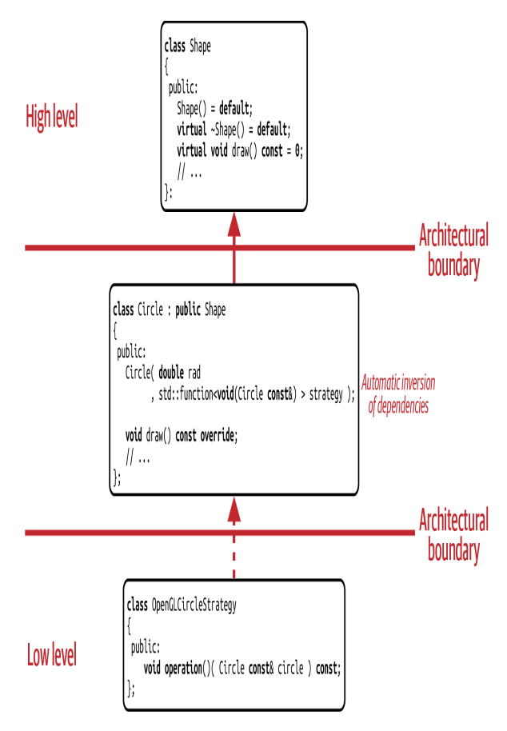
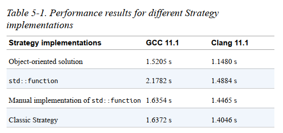

<!-- _paginate: skip -->
# **NODE Technical Book Club**

## C++ Software Design - Klaus Iglberger
<!-- 
ASK: Could you read it? Did you like? Any initial comments?
-->
---
### G20: Favor Composition Over Inheritance
> Inheritance is the base class of evil.
- Inheritance is a powerful feature but it is hard to use it properly.
- It is overused and misused.
<!-- It creates a tight coupling -->
- Design patterns mostly make use of composition.
---
### G21: Use Command to Isolate What Things are Done
Intent of the **Command pattern**: Encapsulate a request as an object, thereby letting you parameterize clients with different requests, queue or log requests, and support undoable operations.
<!-- Allows easy implementation of new kinds of work packages -->
---

<!-- Abstraction is introduced with a Command base class -->
<!-- This enables anyone to implement a new concrete command -->
---
#### Example: Calculator
```cpp
class CalculatorCommand 
{ 
 public: 
  virtual ~CalculatorCommand() = default; 

  virtual int execute(int i) const = 0; 
  virtual int undo(int i) const = 0; 
}; 
```
<!-- CalculatorCommand is the base class for all commands -->
<!-- execute and undo are the two operations -->
<!-- since commands know how to undo themselves, they should implement undo -->
---
```cpp
class Add : public CalculatorCommand 
{ 
 public: 
  explicit Add(int operand) : operand_(operand) {} 
 
  int execute(int i) const override 
    { 
      return i + operand_; 
    } 
  int undo(int i) const override 
    { 
      return i - operand_; 
    } 

 private: 
  int operand_{}; 
}; 
```
**Add**: Concrete command for addition.

---
```cpp
class Calculator 
{ 
 public: 
  void compute(std::unique_ptr<CalculatorCommand> command){
    current_ = command->execute( current_ ); 
    stack_.push( std::move(command) ); 
  }
  void undoLast(){
    if( stack_.empty() ) return; 
    auto command = std::move(stack_.top()); 
    stack_.pop(); 
    current_ = command->undo(current_);
  }

  int result() const { return current_; }
  void clear() { current_ = 0; stack_ = {}; }

 private: 
  int current_{};
  std::stack<std::unique_ptr<CalculatorCommand>> stack_; 
}; 
```
<!-- Calculator has a stack of commands -->
<!-- In the compute method, you can execute any command -->
---


---
**std::for_each** is an example of a command in the standard library.
```cpp
namespace std { 
 
template<typename InputIt, typename UnaryFunction> 
constexpr UnaryFunction 
 for_each(InputIt first, InputIt last, UnaryFunction f); 
} // namespace std 
```
With the third argument, you can specify **what to do** with each element.

---
#### Command vs. Strategy
- Structurally they are same but they differ in intent.
- std::sort use strategy pattern because you can specify **how to do** the sorting.
- std::for_each use command pattern because you can specify **what to do** with each element.
<!-- We can implement calculator example above also a strategy -->
<!-- Command allows undo because only injected function knows how to undo -->
---
### G22: Prefer Value Semantics over Reference Semantics
- GOF style design patterns are firmly rooted in OOP so reference semantics are used.
- But virtual functions adds runtime overhead and use dynamic memory allocation.
---
Reference semantics examples:
- **std::span:** keeps a non-owning reference to a contiguous sequence of objects.
- **std::remove:**
```cpp
std::vector<int> vec{1, -3, 27, 42, 4, -8, 22, 42, 37, 4, 18, 9}; 
auto const pos = std::max_element(begin(vec), end(vec)); 
vec.erase(std::remove(begin(vec), end(vec), *pos), end(vec)); 
// result: {1 -3 27 4 -8 22 42 37 18 9}
```
<!-- derefenced iterator *pos is the issue here, after deleting first 42 it holds location of 4 -->
---
- References, especially pointers, makes our life much harder.
- It's harder to reason about the code so it's easier to introduce bugs.
- **Value semantics** is easier to reason about and less error-prone.
---
- STL containers like **std::vector** are value types.
- Their elements are copied when the container is copied instead of just copying the address.
- Copying might be expensive but **move semantics** can be used to avoid this.
- std::optional and std::variant are also good examples of value semantics.
<!-- optional replaces returning unique_ptr<res>, or bool (int&) etc.  -->
<!-- variant replaces base class pointers -->
---
#### std::function
- It represents an abstraction for a callable.
- It can hold a lambda, a function pointer, a function object.
- It can be used for implementing value semantics implementation of the design patterns.
---
```cpp
void foo(int i) 
{ 
   std::cout << "foo: " << i << '\n'; 
} 
 
int main() 
{ 
   // Create a default std::function instance. Calling it results 
   // in a std::bad_function_call exception 
 std::function<void(int)> f{}; 
 
 f = [](int i){ // Assigning a callable to 'f' 
      std::cout << "lambda: " << i << '\n'; 
   }; 
 
 f(1); // Calling 'f' with the integer '1' 
 
 auto g = f; // Copying 'f' into 'g' 
 
 f = foo; // Assigning a different callable to 'f' 
 
 f(2); // Calling 'f' with the integer '2' 
 g(3); // Calling 'g' with the integer '3' 
 
   return EXIT_SUCCESS; 
}
```
---
#### Strategy Pattern with std::function
```cpp
class Circle : public Shape 
{ 
 public: 
 using DrawStrategy = std::function<void(Circle const&, /*...*/)>; 
 
 explicit Circle( double radius, DrawStrategy drawer ) 
      : radius_( radius ) 
 , drawer_( std::move(drawer) ) 
   { 
      //...
   } 
 
   void draw( /*some arguments*/ ) const override 
   { 
      drawer_( *this, /*some arguments*/ ); 
   } 
 
 private: 
   double radius_; 
   DrawStrategy drawer_; 
}; 
```
<!-- For square we will have the same, but taking Square instead of Circle -->
---
```cpp
class OpenGLCircleStrategy 
{ 
 public: 
   explicit OpenGLCircleStrategy( /* Drawing related arguments */ ); 
 
 void operator()( Circle const& circle, /*...*/ ) const; 
 
 private: 
   /* Drawing related data members, e.g. colors, textures, ... */ 
}; 
```
<!-- It's a function object with a call operator whose type matching our DrawStrategy -->
<!-- It could also be a lambda -->
---
```cpp
std::vector<std::unique_ptr<Shape>> shapes{};

shapes.emplace_back( 
      std::make_unique<Circle>(2.3, OpenGLCircleStrategy(/*...red...*/))); 
shapes.emplace_back(
      std::make_unique<Square>(1.2, OpenGLSquareStrategy(/*...green...*/)));
shapes.emplace_back( 
      std::make_unique<Circle>( 4.1, OpenGLCircleStrategy(/*...blue...*/) ) );

for( auto const& shape : shapes ) 
{ 
  shape->draw(); 
} 
```
<!-- Main is very similar to original -->
<!-- But now we have non-intrusive, base class-free design -->
---

<!-- Looks much simpler -->
---
**std::function** has performance overhead if you use the standard implementation.

<!-- Manual implementation will be explained in the Ch. 8 -->
---
# Final Comments?
**See you in part 4!**