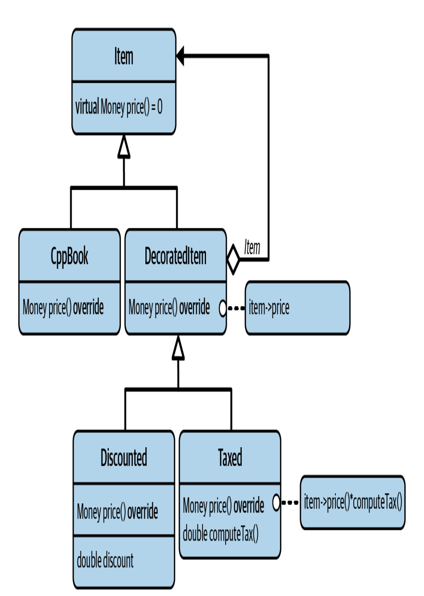
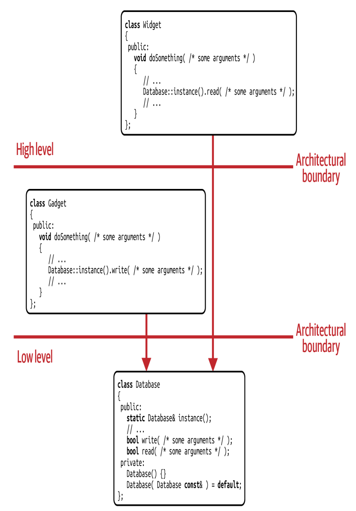
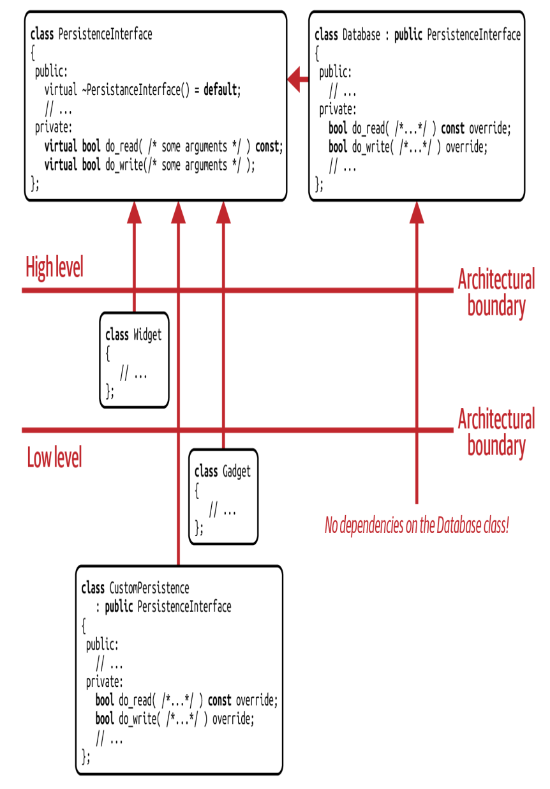

<!-- _paginate: skip -->
# **NODE Technical Book Club**

## C++ Software Design - Klaus Iglberger
---
<!-- PART 4 -->
### G35: Use Decorators to Add Customization **Hierarchically**
- Intent of the **Decorator pattern**: Attach additional responsibilities to an object dynamically. Decorators provide a flexible alternative to subclassing for extending functionality.

---
#### Pricing Strategy Example
- Inheritance-based design: Poor reusability and maintainability.
- Stragety-based design: Combining different pricing strategies is not easy.
<!-- Strategy: requires code duplication -->

- We need more like a hierarchical form of strategy, which decouples the pricing strategies but also allows to combine them

**Decorator pattern** is the solution.

---

<!-- Addition of new responsibilities is identified as variation point and extracted in the form of the DecoratedItem class. -->
<!-- It derives from Item but also contains item -->
---
```cpp
class DecoratedItem: public Item{
  public:
    explicit DecoratedItem(std::unique_ptr<Item> item)
      : item_(std::move(item)){}
    protected:
      Item& item() { return *item_; }
      Item const& item() const { return *item_; }
    private:
      std::unique_ptr<Item> item_;
};

class Discounted: public DecoratedItem{
  public:
    explicit Discounted(double discount, std::unique_ptr<Item> item)
      : DecoratedItem(std::move(item)), factor_(1.0 - discount){}
    double price() const override{
      return factor_ * item().price();
    }
  private:
    double factor_;
};
```

---
```cpp

  // 7% tax: 19*1.07 = 20.33
std::unique_ptr<Item> item1(
  std::make_unique<Taxed>(0.07,
    std::make_unique<CppBook>("Effective C++", 19.0)));

// 20% discount, 19% tax: (999*0.8)*1.19 = 951.05
std::unique_ptr<Item> item2(
  std::make_unique<Taxed>(0.19,
    std::make_unique<Discounted>(0.2,
      std::make_unique<ConferenceTicket>("CppCon", 999.0))));

Money const totalPrice1 = item1->price(); // Results in 20.33
Money const totalPrice2 = item2->price(); // Results in 951.05

```  

---
### Decorator vs. Adapter and Strategy
- **Adapter:** Only aims to adapt the interface of an object, is not concerned with adding new responsibilities.
- **Strategy:** It also provides the ability to customize functionality. But it is focused on representing different implementations and switching between them.
- **Decorator:** It is focused on removing the dependency between attachable pieces of functionality.
<!-- Gut vs skin -->
<!-- One can combine decorator and strategy if needed -->
---
### Shortcomings of the Decorator Pattern
- Every level of the hierarchy adds one more level of indirection -> performance overhead.
- Potential danger of combining decorators in a nonsensical way.
<!-- Nonsensical: Taxed<Taxed> or Discounted<Taxed> ... -->
---
### G36: Understand the Trade-off Between Runtime and Compile Time Abstraction
- Two approaches using value semantics: using static and dynamic polymorphism
---
<!-- template solution -->
```cpp
  template<double discount, PricedItem Item>
class Discounted // Using composition
{
public:
template<typename... Args>
explicit Discounted(Args&&... args)
: item_{ std::forward<Args>(args)... } {}

Money price() const {
  return item_.price() * (1.0 - discount);
}

private:
  Item item_;
};

// 20% discount, 15% tax: (499*0.8)*1.15 = 459.08
Taxed<0.15,Discounted<0.2,ConferenceTicket>> item{ "Core C++", 499.0 };

Money const totalPrice = item.price(); // Results in 459.08
```
<!-- This is very fast(almost everything happens in compile time?) -->
<!-- No runtime flexibility, even discount/tax rate should be known -->
<!-- Increases compile time -->
---
```cpp
class Item
{
private:
struct Concept
{
  virtual Money price() const = 0;
  virtual std::unique_ptr<Concept> clone() const = 0;
};

template<typename T>
struct Model : public Concept
{
  explicit Model(T const& item) : item_(item) {}
  explicit Model(T&& item) : item_(std::move(item)) {}
  Money price() const override
  {
    return item_.price();
  }
  std::unique_ptr<Concept> clone() const override
  {
    return std::make_unique<Model<T>>(*this);
  }
  T item_;
};

std::unique_ptr<Concept> pimpl_;
};
```

---
```cpp
public:
  template< typename T >
  Item( T item )
    : pimpl_( std::make_unique<Model<T>>( std::move(item) ) ) {}
  Item( Item const& item ) : pimpl_( item.pimpl_->clone() ) {}
  Item& operator=( Item const& item )
  {
    pimpl_ = item.pimpl_->clone();
    return *this;
  }
  Money price() const { return pimpl_->price(); }
```
```cpp
// 20% discount, 15% tax: (499*0.8)*1.15 = 459.08
Item item(Taxed(0.19, Discounted(0.2, ConferenceTicket{"Core
C++",499.0})));
Money const totalPrice = item.price();
``` 

<!-- But this is not much faster than classic implementation -->
---
### G37: Treat Singleton as an Implementation Pattern
<!-- What do you think about it? Antipattern? -->
- Many consider it as an antipattern.
- Intent: Ensure a class has only one instance and provide a global point of access to it.
- Not a design pattern because it doesn't introduce any abstraction.
<!-- A design pattern has a name, carries an intent, introduces an abstraction, has been proven -->
---
### G38: Design Singletons for Change and Testability
- Core guideline: Avoid singletons.
- It causes artificial dependencies and makes testing harder.
---

<!-- proper dep graph: all dep arrow run towards to high levels -->
<!-- undesired dependency from high level to low level -->
<!-- since we depend on the solid implementation -->
---
- Need to introduce an abstraction to get rid of dependency issues -> **Strategy pattern**
---


---
### G39: Continue to Learn About Design Patterns
Most important advices:
- Minimize dependencies
- Separate concerns
- Prefer composition over inheritance
- Prefer a nonintrusive design
- Prefer value semantics over reference semantics
- Know the design patterns
---
<!-- enddd -->
## Final Words
#### Thanks for participating!


