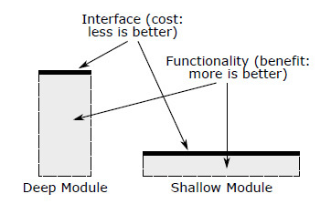
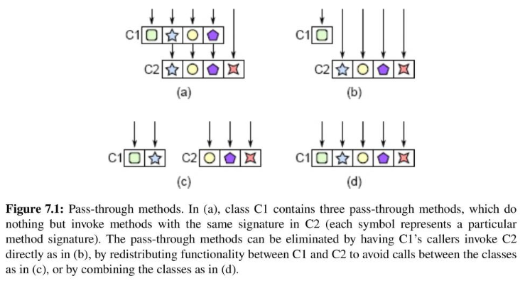

<!-- _paginate: skip -->
# **NODE Technical Book Club**

## A Philosophy of Software Design -  John Ousterhout
<!-- 
Second book of the club.
Based on a course, an attempt to teach software design.
Book is about, desing principles emerged from that.
ASK: Did you like it? Any initial comments?
-->
---
## Introduction 
### (It's all about complexity)
**Complexity is the root of all evil in software.**
Two approaches to fight complexity:
- Making code simpler and more obvious
- Encapsulating it (Modular design)
<!-- Also some discussion about waterfall vs agile -->
---
Goals of the book:
* Describe the nature of software complexity
<!-- What does it mean, why does it matter, how can you recognize it -->
* Present techniques to minimize complexity
<!-- Best way to use this book is in conjuction with code reviews. -->
<!-- ASK: How can we do it? -->
---
## The Nature of Complexity
- Complexity is anything related to the structure of a software system that makes it **hard to understand and modify the system**.
<!-- People often think of complexity as the number of lines of code, but it's not. -->
- More common parts of code has more impact on complexity.
---
- Symptoms of complexity:
  * **Change amplification**: Small changes require large amounts of code to be modified.
  <!-- Change amplification -> coupling -->
  <!-- Example: set color on each page vs global color -->
  * **Cognitive load**: Hard to keep the entire system in your head.
  <!-- Cognitive Load Example: Pointers need to remember to free -->
  * **Unknown unknowns**: Hard to predict the impact of changes.
  <!-- Unknown Unknows' opposite: obvious. -->
  <!-- Unknown Unknows are the worst. -->
  <!-- ASK : Do you agree? -->
---
- Causes of complexity:
  * **Dependencies**: A change in one part of the system requires changes in other parts.
  <!-- Dependency exist when a piece of code cannot be understood and modified in isolation -->
  <!-- It is unavoidable and fundamental part of software -->
  <!-- Example: function interface and caller -->
  <!-- But we must try to reduce the number of deps and make them simple and obvious as possible -->
  * **Obscurity**: Important information like a dependency is not obvious.
  <!-- Examples: meaningless names -->
  <!-- ASK: Do you have any examples for obscurity? Like unexpected problems after a change-->
---
## Working Code Isn't Enough 
### (Strategic vs. Tactical Programming)
* Tactical programming: Get it to work as quickly as possible.
<!-- Tactial: Usual Startup style -->
<!-- That's how systems become complicated -->
* Strategic programming: Think about the long-term implications of your design decisions.
<!-- Strategic: As title suggests Working code isn't enough-->
<!-- The goal is produce a great design which also happens to work -->
* The question is how much to invest?
<!-- Reminds me Tidy First -->
<!-- He suggests 10 - 20 % of total development time -->
<!-- ASK: Do you agree? -->
---
## Modules Should Be Deep
- The goal of modular design is to minimize dependencies between modules.
- Think of a module in two parts:
  * **Interface**: What does the module do?
  * **Implementation**: How does it do it?
* Best modules are those whose interfaces are much simpler than their implementations.
<!-- Advantages of deep modules: Minimized dependencies, easier to change implementation -->
---


- Module depth is a way of thinking about cost versus benefit.
  - **Benefits**: The functionality provided by the module.
  - **Costs**: Its interface
<!-- ASK: I didn't think that much about interfaces before. Did you? -->
---
# <!-- _backgroundColor: #8f0000  -->
### :triangular_flag_on_post: Red Flag : Shallow Module
A shallow module is one whose interface is complicated relative to the functionality it provides. They don’t help much in the battle against complexity.
<!-- The benefit they provide doesn't worth the cost -->
---
```csharp
private void addNullValueForAttribute(String attribute) {
  data.put(attribute, null);
}
```
<!-- Well thanks :D -->
<!-- From the complexity point of view, this makes things worse not better -->
---
### Classitis
<!-- Large number of shallow class -->
<!-- Discuss: SOLID? -->
Example: Java class library
``` java
  FileInputStream fileStream =
    new FileInputStream(fileName);
  BufferedInputStream bufferedStream =
    new BufferedInputStream(fileStream);
  ObjectInputStream objectStream =
    new ObjectInputStream(bufferedStream);
```
Interfaces should be designed to make the common case as simple as possible.
<!-- Unix system calls are a good example of this.
in Unix it is single function: open(fileName, O_RDONLY); -->
<!-- Users need to create three different objects to open and read serialized data from a file. -->
<!-- Which is default behavior usually -->
<!-- First object is useless by itself -->
---
### Information Hiding (and Leakage)
<!-- A technique for deep modules -->
- **Information hiding**: Each module should encapsulate a few pieces of knowledge. It is embedded in implementation and not visible in the interface.
<!-- Example: How to parse json -->
- It simplifies the interface.
- It makes it easier to evolve the system.
<!-- Hidden means no dependency so easier to change -->
* Design question: What information can be hidden in that module?
---
# <!-- _backgroundColor: #8f0000  -->
### :triangular_flag_on_post: Red Flag : Information Leakage
Information leakage occurs when the same knowledge used in multiple places, such as two different classes that both understand the format of a particular type of file.
<!-- Ask yourself how can I reorganize them? -->
<!-- Options: merge them or factor out -->
---
# <!-- _backgroundColor: #8f0000  -->
### :triangular_flag_on_post: Red Flag : Temporal Decomposition
In temporal decomposition, execution order is reflected in the code structure: operations that happen at different times are in different methods or classes. If the same knowledge is used at different points in execution, it gets encoded in multiple places, resulting in information leakage. 
<!-- When designing modules: focus on knowledge needed not the order of execution -->

---
### Example: HTTP Server
<!-- HTTP Protocol Project -->
Common Mistakes:
* Excessive class division led to information leakage.
    <!-- Consolidate classes for better information hiding. -->
* Shallow parameter handling interfaces exposed internal representations.
    <!-- Use deeper interfaces to hide internal details. -->
* Inadequate defaults in HTTP responses increased complexity. (:triangular_flag_on_post: **Red Flag: Overexposure**)
    <!-- Provide sensible defaults for simpler usage. -->
---
### General Purpose Modules are Deeper
- Specialization leads complexity.
- There is a trade-off between generality and current needs.
- **Make classes somewhat general purpose.**
- The functionality should reflect your current needs, but its interface should be general enough to accommodate future needs.
<!-- ASK: How do you usually approach this problem? What criteria you consider?-->
---
### Example: Text Editor

- Specialized Approach:
  - Text class designed with specialized methods like backspace and delete.
  - Methods tailored to specific user interface operations.
  - Increased cognitive load for developers and information leakage between text and user interface classes.
---
- General-Purpose Approach:
  - Text class with generic methods for text modification (insert, delete).
  - Utilizes a generic type Position instead of specific UI-related types.
  - Cleaner separation between text and UI classes, promoting better information hiding.
---
### Questions to Ask Yourself
* What is the simplest interface that will meet my current needs?
* In how many situations will this method be used?
<!-- If it is designed for particular use, it might be a red flag. -->
<!-- Example: backspace vs delete -->
* Is this API easy to use for my current needs?
<!-- If it is not easy, you might have gone too far -->
---
### Push Specialization Upwards and Downwards

* Specialized features located at top-level classes, keeping lower-level classes general-purpose.

*  Specialized features delegated to lower-level classes, maintaining core functionality as general-purpose.

* **Example**: specialized undo handlers separated into a History class while core functionality remains general-purpose.
---
### Different Layer, Different Abstraction
- In a well-designed system, each layer provides a different level of abstraction.
- :triangular_flag_on_post: **Red Flag**: If a system contains adjacent layers with similar abstractions, it suggests a problem with the class decomposition.
---
# <!-- _backgroundColor: #8f0000  -->
### :triangular_flag_on_post: Red Flag : Pass-through Methods
```java
public class TextDocument ... {
public Character getLastTypedCharacter() {
  return textArea.getLastTypedCharacter();
}
public void insertString(String textToInsert,
int offset) {
  textArea.insertString(textToInsert, offset);
}
public void willInsertString(String stringToInsert,
int offset) {
  if (listener != null) {
    listener.willInsertString(this, stringToInsert, offset);
  }
}
```
<!-- Shallow methods, doesn't add any value -->
<!-- Indicates there is confusion over the division of responsibilities -->
<!-- ASK: Do you have examples from our codebase? -->

---

<!-- b: expose the lower level class directly -->
<!-- c: redistribute the functionality -->
<!-- d: merge them -->
---
**When is interface duplication okay?**
- Each method should contribute significant functionality.
- **Example**: Dispatcher
<!-- Has same interface but calls the correct method -->
---
### Decorators
- Decorator is used to seperate specializations from general-purpose classes.
- It encourages API duplication across layers and they tend to be shallow.
- **Consider the alternatives**:
  - Add directly to underlying class.
  - Merge with an existing decorator.
  - Implement as a standalone class.
  <!-- So there is usually a better alternative -->
---

### Pass-Through Variables
- A variable is passed through a long chain of methods without being used.
<!-- Adds complexity because all methods unnecessarily depend on it-->
- **To eliminate**: 
  - Store in a shared object.
  - Use a global variable.
  <!-- Global variable has many problems e.g. testing -->
  - Use a context object.
  <!-- Context object is the suggested alternative -->
  <!-- Kind of similar to global variable but better -->
  <!-- It is passed as refence in constructor once, so not seen in interface. -->
---
### Pull Complexity Downwards
- Handle complexity internally instead of exposing to users.
- It is more important to keep the interface simple than to keep the implementation simple.
- **Example**: Configuration parameters
  - **Bad**: Let the user choose the parameters(handle complexity).
  - **Good**: Determine right defaults internally.
- Do not take it too far, consider overall complexity.
---
# **Comments**
