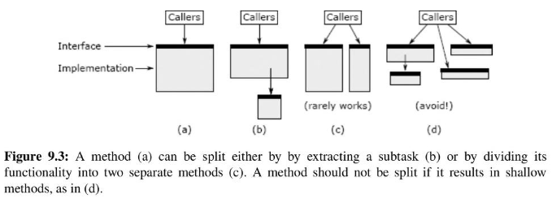
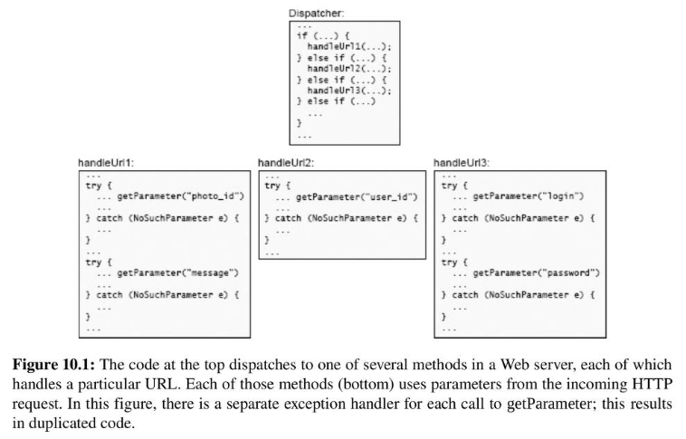
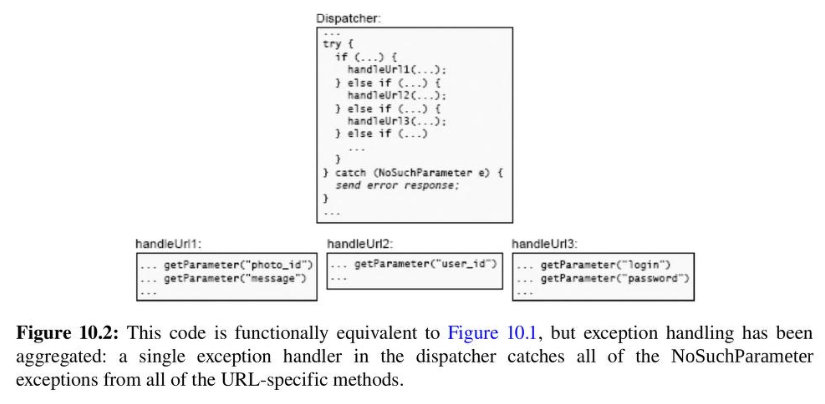

<!-- _paginate: skip -->
# **NODE Technical Book Club**

## A Philosophy of Software Design -  John Ousterhout
<!-- 
Will cover chapters 9-11
-->
---
## Better Together or Better Apart? 
<!-- SOLID: What is "single " in single responsibility? -->
<!-- Applies to all levels: function, class etc. -->
Should two functionalities be in the same module or separate modules?
- Smaller components:
  - Easier to understand subcomponents.
  - More interfaces to manage -> more complexity
  - Seperation -> more unknown unknowns
  - More duplication
---
Together is better if they are closely related. Indicators:
- Shared information
- Being used together
- Conceptual overlap
- Hard to understand one without the other
---
# <!-- _backgroundColor: #8f0000  -->
### :triangular_flag_on_post: Red Flag : Repetition
If the same piece of code appears over and over again, that's a red flag that you haven't found the right abstractions.

---

```cpp
switch (common->opcode) {
  case DATA: {
    DataHeaders header = received->getStart<DataHeader>(); 
    if (header == NULL) {
      LOGCWARNING, "%s packet from %s too short (%u bytes)", 
      opcodeSymbol (common->opcode) ,  received->sender->toString(), received->len);
      return;
    }
  }
  case GRANT: { 
    GrantHeaders header = received->getStart<GrantHeader>(); 
    if (header == NULL) {
      LOGCWARNING, "%s packet from %s too short (%u bytes)", opcodeSymbol (common->opcode) , received->sender->toString(), received->len);
    return;
    }
  }
  case RESEND: { 
    ResendHeaders header = received->getStart<ResendHeader>(); 
    if (header == NULL) {
      LOGCWARNING, "%s packet from %s too short (%u bytes)", opcodeSymbol (common->opcode) , received->sender->toString(), received->len);
    return;
    }
  }
}
```
Repeated logging for each case

---
Refactored to:
```cpp
switch (common->opcode) {
  case DATA: {
    DataHeaders header = received->getStart<DataHeader>();
    if (header == NULL) goto packetTooShort;
  }
  case GRANT: {
    GrantHeaders header = received->getStart<GrantHeader>();
    if (header == NULL) goto packetTooShort;
  }
case RESEND: {
  ResendHeader* header = received->getStart<ResendHeader>();

if (header == NULL) goto packetTooShort;

}

packetTooShort:
LOG(WARNING, "%s packet from %s too short (%u bytes)", opcodeSymbol (common->opcode) , received->sender->toString(), received->len);

return;
```
<!-- Is this really much better? -->
<!-- Maybe checkNull to move if logic also -->

---
# <!-- _backgroundColor: #8f0000  -->
### :triangular_flag_on_post: Red Flag : Special-General Mixture 
It's a red flag when a general-purpose mechanism also contains code specialized for a particular use of that mechanism. 
This makes the mechanism more complicated and creates information leakage between the mechanism and the particular use case.
<!-- future modifications to the use case are likely to require changes to the underlying mechanism as well. -->

---
Examples:
* Insertion cursor and selection -> better apart
* Separate logging methods for each case -> better together

---
## Splitting and Joining Methods
- Each method should do one thing and do it completely.
- Splitting up a method only makes sense if it results in cleaner abstractions.


<!-- b) Split subtask -> Best way. Commonly done when subtask is general purpose  -->
<!-- c) Divide in two -> If the original method tries to do multiple not closely related things. Doesn't make sense if most callers still need to invoke both. -->
<!-- In c it says rarely works because caller needs to deal with multiple methods instead of one. And there is a risk of ending up with shallow methods as in d)-->
<!--  -->
---
- Join methods if:
  - It leads to deeper methods
  - It eliminates duplication
  - It eliminates unnecessary interfaces or data structures
  - It results in better encapsulation

---
# <!-- _backgroundColor: #8f0000  -->
### :triangular_flag_on_post: Red Flag : Conjoined Methods
It should be possible to understand each method independently. If you can’t understand the implementation of one method without also understanding the implementation of another, that’s a red flag. 
<!-- This red flag can occur in other contexts as well: if two pieces of code are physically separated, but each can only be understood by looking at the other, that is a red flag. -->
---
## A Different Opinion: Clean Code
- In the book Clean Code, Robert C. Martin argues that functions should be broken up based on length alone.
> The first rule of functions is that they should be small. The second rule of functions is that they should be smaller than that.
- BUT: Depth is more important than length. Don't sacrifice depth for length.
<!-- - More functions -> more interfaces to manage -> more complexity -->
---
## Define Errors Out of Existence
<!-- A chapter I liked -->
- Exception handling is one of the worst sources of the complexity.
<!-- Devs open define exceptions without considering how they will be handled -->
- AIM: To reduce number of places where exceptions must be handled
<!-- Define errors out of existence: Design so that normal operation handles  all situations and no exceptional condition -->
---
- An exception distrupts the normal flow of the code.
<!-- Reasons for exceptions: bad inputs, misconfiguration, resource not available, network issues -->
- When an exception is caught, we need to either:
  - Try to fix it and complete the work.
  <!-- It is usually not obvious how to fix, and fixing operations might cause other problems. e.g. duplicate response if exception is caused by a delay -->
  - Abort it and report upwards.
  <!-- In abort we also need to clean up internal state -->
---
### Example: Unset in TCL
<!-- We will see some examples in next few slides -->
<!-- Unset: deletes a variable -->
* It throws an exception if the variable doesn't exist.
 <!-- Exceptions are part of the interface so throwing exceptions make module shallower -->
* It should have simply returned without doing anything -> define errors out of existence
 <!-- Changing its definition from deleting a variable to ensuring it doesn't exist -->
---
### Example: File Deletion in Windows
- In an OS, deleting an open file is tricky.
* Windows: returns an error if the file is open.
* Unix: deletes the file but it's still accessible until the last handle is closed -> define errors out of existence
---
### Example: Java Substring Method
- Java's substring method throws an exception if the index is out of bounds.
<!-- The exception is unnecessary and makes the use of the method more complicated. Try catch etc. -->
* It should have returned an empty string.
---
### Mask Exceptions
<!-- Exception masking: Another technique to reduce number of places where exceptions must be handled. -->
- Handle exceptional conditions at a low level in the system so that they don't propagate upwards.
- Example: TCP sends lost packets again without informing the application.
<!-- Similar to define errors out existence but here method takes action to fix the issue -->
- Example: NFS client retries requests over and over again if the server fails to respond.
<!-- People complain about application is hanging because of this and suggest it should abort. -->
<!-- ASK: What do you think? -->
<!-- Exception masking is an example of pulling complexity downwards. -->
---
### Exception Aggregation
<!-- The third technique to reduce the number of places where exceptions must be handled is to aggregate exceptions. -->
- Handle multiple exceptions in one place.
- Example: Missing parameters in a Web server.
---
From:


---
To:

<!-- Opposite of exception masking. The more upwards means more aggregation. -->
---
### Just Crash
<!-- Fourth technique: crash -->
- If an error is difficult or impossible to handle and it's unlikely to occur, just crash.
- Example: Out of memory
- Counterexample: malloc in C returns NULL if out of memory. 
<!-- BAD because you always need to check for NULL -->
<!-- Better approach: checked_alloc that aborts if null -->
---
## Design it Twice
- It's unlikely that you will get the design right the first time.
- Consider multiple options for the major design decisions.
- Try to pick approaches that are radically different from each other.
- Compare them and finalize the design.
---
**Questions to ask:**
- Is one alternative easier to use?
- Does one alternative have a simpler interface?
- Is one interface more general-purpose?
- Does one interface enable a more efficient implementation?
<!-- Based on these questions you can decide on the final design. The final design can also be a combination of the alternatives.  --> 
<!-- Also improves design skills -->
---
# **Comments**


