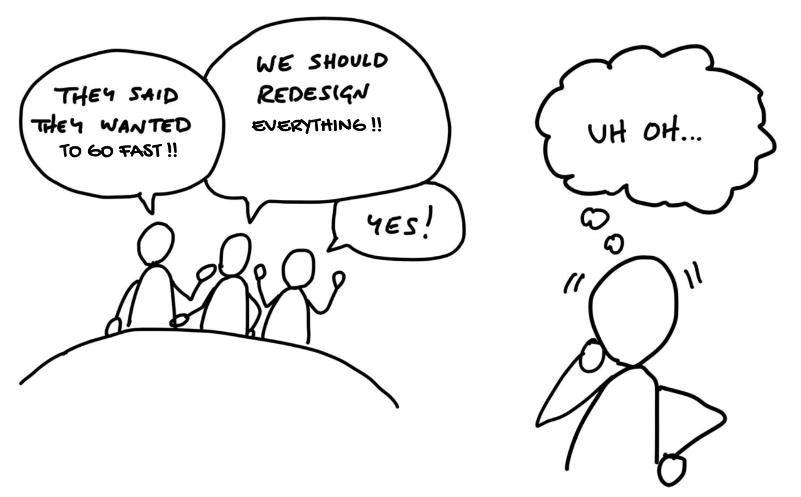
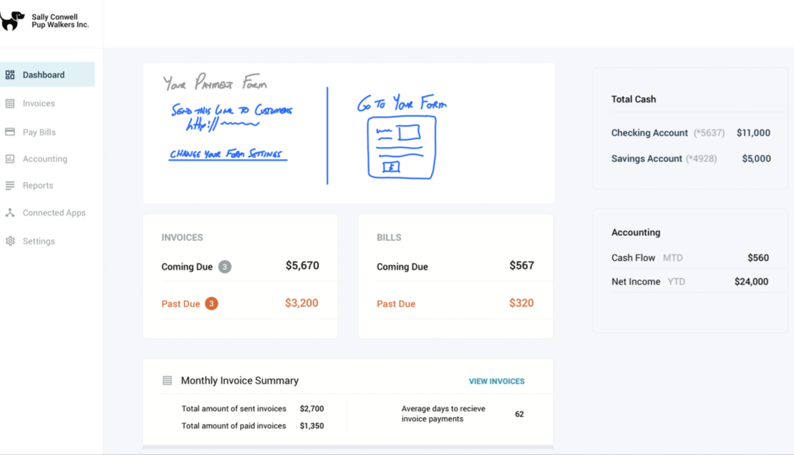
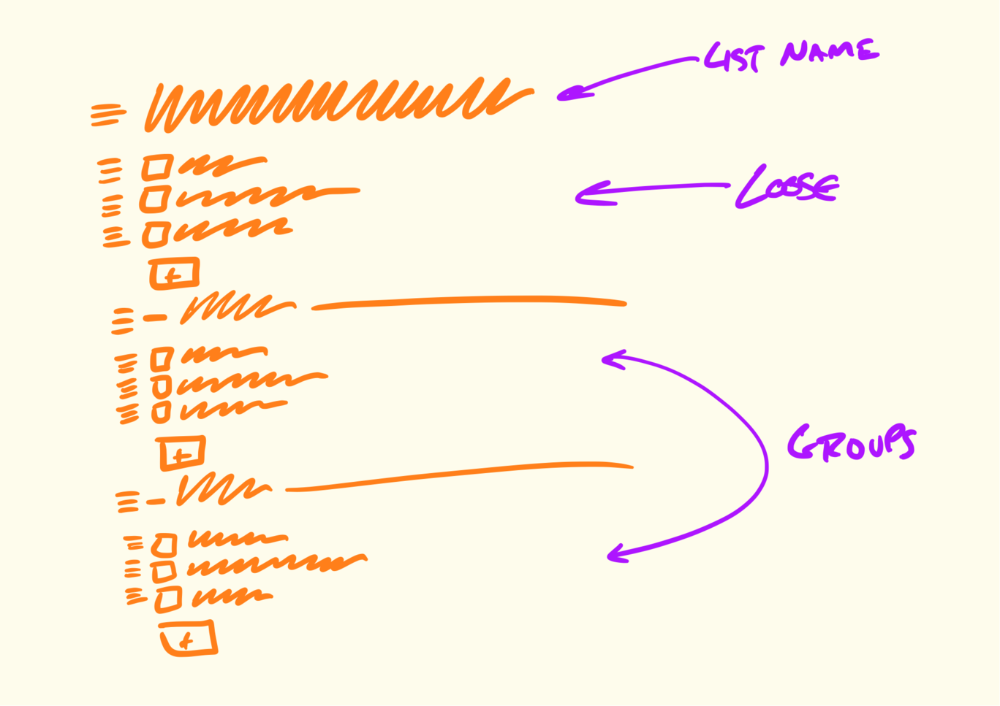

<!-- _paginate: skip -->
# **NODE Technical Book Club**

## Shape Up
##### Stop Running in Circles and Ship Work that Matters 
Ryan Singer

---
## Background
- What do you know about Basecamp?
<!-- Simplicity focused, All-in-One Tool -->
- Have you heard about Shape Up before?
---
### How do they work?
- No waterfall, agile or scrum
- No dailies, sprint etc.
- No backlogs, no Kanban , no velocity tracking 

 #### **Entirely** different approach!

---
## Motivation
As software teams start to grow, some **common struggles** appear:

* Team members feel like projects go on and on, with no end in sight.
* Product managers can’t find time to think strategically about the product.
* Founders ask themselves: *“Why can’t we get features out the door like we used to in the early days?”*
---
## Main Ideas
* Six-week cycles
<!-- 6 weeks vs 2 weeks -->
* Shaping the work
<!-- Do you think we do shaping or what is the correspondent? -->
* Making teams responsible
* Targeting Risk

---
## Principles of Shaping

<!-- When we shape the work, we need to do it at the right level of abstraction: not too vague and not too concrete. Product managers often err on one of these two extremes. -->
<!-- 
Wireframes(drat?) are too concrete:
    I’ll give a wireframe to my designer, and then I’m saying to her: “I know you’re looking at this, but that’s not what I want you to design. I want you to re-think it!” It’s hard to do that when you’re giving them this concrete thing.
 -->
 <!-- 
 Words are too abstract 
    Team members don’t have enough information to make trade-offs. They don’t know what to include or leave out. A programmer who worked in that situation said:
    You’re solving a problem with no context. You have to be a mind reader. It’s like: “we’ll know it when we see it.”
-->
---
### Case study: The Dot Grid Calendar 

<!-- Note how rough the sketch is and how many details are left out. The designer had a lot of room to interpret how this should look and feel. -->
<!-- At the same time, note how specific the idea is. It’s very clear how it works, what needs to be built, what’s in and what’s out. -->
<!-- Properties: rough, solved, bounded -->

---

---
### Who Shapes?

Shaping is creative and integrative. It requires combining interface ideas with technical possibilities with business priorities. To do that you’ll need to either embody these skills as a generalist or collaborate with one or two other people.
<!-- 
Shaping is primarily design work. The shaped concept is an interaction design viewed from the user’s perspective. It defines what the feature does, how it works, and where it fits into existing flows. -->
<!-- You don’t need to be a programmer to shape, but you need to be technically literate. You should be able to judge what’s possible, what’s easy and what’s hard. Knowledge about how the system works will help you see opportunities or obstacles for implementing your idea. -->
<!-- It’s also strategic work. Setting the appetite and coming up with a solution requires you to be critical about the problem. What are we trying to solve? Why does it matter? What counts as success? Which customers are affected? What is the cost of doing this instead of something else? -->

---
### Steps to Shaping
1. Set boundaries
<!-- 1. How much time we want to spend on it? -->
2. Rough out the elements
<!-- 2. The output of this step is an idea that solves the problem within the appetite but without all the fine details worked out. -->
3. Address risks and rabbit holes
<!-- 3. We take a hard look at it to find holes or unanswered questions that could trip up the team. -->
4. Write the pitch
<!-- 4. The pitch summarizes the problem, constraints, solution, rabbit holes, and limitations. -->
---
### Set Boundaries

---
#### Set the **Appetite**
<!-- Start with a Raw Idea -->
<!-- Example: “Customers are asking for group notifications.” -->
- Define how much time and effort the project deserves: Small Batch (1-2 weeks) or Big Batch (6 weeks).
- Avoid jumping to solutions without first determining the value.
- Time(*Appetite*) is fixed; scope can be reduced to fit within the timeframe.
<!-- - Example: Book writing – trade-off between adding sections and fixing typos. -->

---
<!-- Narrowing the problem -->
- Investigate the Core Issue
  - Example: “Customers want a calendar.” Ask: “What problem are they trying to solve?”
  <!-- Focus on specific needs (e.g., “see free spaces” vs. full calendar functionality). -->
- Respond with caution
  - Don’t say “yes” or “no” too quickly. Keep it open: “Maybe some day.”
<!-- Let ideas evolve with more information before committing. -->

- Avoid ambiguous requests like “Files 2.0.”

---
### Find The Elements

<!-- Now that we have the constraints of an appetite and the problem we’re solving, it’s time to get from an idea in words to the elements of a software solution. There could be dozens of different ways to approach the solution for a problem. So it’s important that we can move fast and cover a lot of different ideas without getting dragged down. -->
---
#### Move at the right speed 
- Have the right people in the room.
- Avoid wrong level of detail in the sketches
- Try to answer the questions:
    * Where in the current system does the new thing fit?
    * How do you get to it?
    * What are the key components or interactions?
    * Where does it take you?
---
#### Breadboarding

<!-- Technique to sketch and discuss the key components and connections of an interface idea without specifying a particular visual design. -->

<!-- We’ll use words for everything instead of pictures. The important things are the components we’re identifying and their connections. They allow us to play out an idea and judge if the sequence of actions serves the use case we’re trying to solve. -->
---
### Fat marker sketches
<!-- Sometimes the idea we have in mind is a visual one. Breadboarding would just miss the point because the 2D arrangement of elements is the fundamental problem. -->
<!-- A fat marker sketch is a sketch made with such broad strokes that adding detail is difficult or impossible. -->

---
### Elements are the output
- Autopay:
    - A new “use this to Autopay?” checkbox on the existing “Pay an invoice” screen
    - A “disable Autopay” option on the invoicer’s side
- To-do groups:
    - Loose to-dos above the first group belong directly to the parent
    - Grouped to-dos appear below the loose to-dos
    - We’d like to try an add affordance within each section
<!-- The elements do not have too much or too little detail -->
<!-- Other details are left to designers creativity -->
---
### Risks and Rabbit Holes

<!-- Remember that we’re shaping work for a fixed time window. We may trust from our experience that the elements we fleshed out in the previous chapter are buildable within the appetite (six weeks). But we need to look closer, because all it takes is one hole in the concept to derail that. Suppose we bet on the project and a team takes it on. If they run into an unanticipated problem that takes two weeks to solve, they just burned a third of the budget! -->
<!-- Even worse, sometimes you run into problems that don’t just delay the project—they have no apparent solution.-->
<!-- Of course there will always be unknowns. That’s why we apply the many practices in Part Three so that teams tackle the right problems in the right order, leaving room for the unexpected. But that doesn’t mean we shouldn’t look for the pitfalls we can find up front and eliminate them before betting on the project. Before we consider it safe to bet on, a shaped project should be as free of holes as possible. -->
---
#### Look for the rabbit holes
Walk through a use case in slow motion. Ask questions:
- Does this require new technical work we’ve never done before?
- Are we making assumptions about how the parts fit together?
- Are we assuming a design solution exists that we couldn’t come up with ourselves?
- Is there a hard decision we should settle in advance so it doesn’t trip up the team?
<!-- Example hard decision: How to handle completed items in grouped to-dos. Solution: Instead of grouping or segmenting them, they decided to just append the name of the group to each completed item. They justified the trade-off: it drastically simplified the problem, and they could still show completed items from a group on the group’s detail page. -->
<!-- This is the kind of trade-off that’s difficult to make when you’re working inside the cycle under pressure.  -->
---
#### Set Focus & Validate
- Set clear boundaries by declaring what’s out of scope to avoid feature creep.
- Cut unnecessary features, even if appealing.
- Present the concept to technical experts to validate feasibility within the time frame. Ask, “Can this be done in 6 weeks?” and identify risks that could blow up the project.
---
### Write the Pitch

<!-- We’ve got the elements of a solution now, and we’ve de-risked our concept to the point that we’re confident it’s a good option to give a team. But the concept is still in our heads or in some hard-to-decipher drawings on the whiteboard or our notebook. Now we need to put the concept into a form that other people will be able to understand, digest, and respond to. -->
<!-- There are five ingredients that we always want to include in a pitch: -->
<!-- Problem, Appetite, Solution, Rabbit holes, No-gos -->
---
#### Ingredient 1. Problem  
 It’s critical to always present both a problem and a solution together.
<!-- Establishing the problem also lets us have a clearer conversation later when it’s time to pitch the idea or bet on it.  -->
#### Ingredient 2. Appetite
 Not only do we want to solve this use case, we want to come up with a way to do it with this appetite. 
<!-- 6 weeks usually or 2 weeks for smaller batches -->
<!-- Stating the appetite in the pitch prevents unproductive conversations. There’s always a better solution. The question is, if we only care enough to spend two weeks on this now, how does this specific solution look? -->
<!-- Anybody can suggest expensive and complicated solutions. It takes work and design insight to get to a simple idea that fits in a small time box. Stating the appetite and embracing it as a constraint turns everyone into a partner in that process. -->
---
#### Ingredient 3. Solution
- People who read the pitch and look at the drawings without much context need to “get” the idea.
<!-- Therefore we need some techniques to help people see the idea while still not going too far into irrelevant details. -->

Embedded sketch technique

---

Annotated fat marker sketch technique

---
#### Ingredient 4. Rabbit holes     
Usually addressing a rabbit hole just requires a few lines of text. 
#### Ingredient 5. No Gos 
Lastly if there’s anything we’re not doing in this concept, it’s good to mention it here.

---
### Ready to Present
- Present pitches asynchronously to maximize focused work time.
- Post write-ups in accessible locations for easy access.
- Aim for stakeholders to read pitches in advance; use live discussions only when needed.
- In Basecamp, pitches are posted in the Pitch category under the Product Strategy team for easy access and reference.

---
# Final Words
**See you in the next part!**