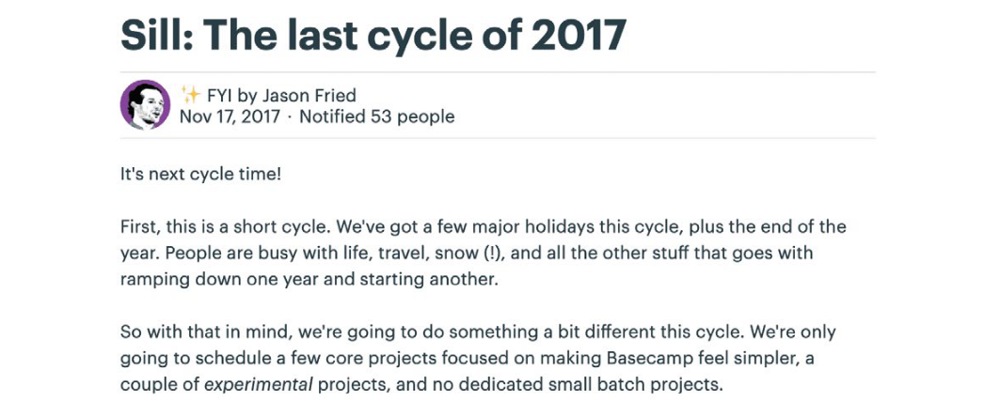

<!-- _paginate: skip -->
# **NODE Technical Book Club**

## Shape Up
##### Stop Running in Circles and Ship Work that Matters 
##### Part 2 - Betting
Ryan Singer

---
### Bets, Not Backlogs
<!-- Now that we'we a pitch, where does it go? Not to a backlog. -->
- Backlogs are a big weight we don't need to carry.
<!-- Growing pile of tasks gives us a feeling like we're always behind. -->
<!-- ASK: Does agile have an answer for that? -->
- Instead, they have a few potential bets.
<!-- Pithces are the bets, so they are well-shaped risk reduced options. unlike tickets in the backlog -->
- They either choose to bet on the pitch or ignore it entirely.
<!-- Someone might reshape and present it again -->
- **Claim:** Important ideas will come back.
<!-- Customers complain again or a new customer hits it. -> Not nice?  -->
---
### The Betting Table
<!-- Now we have a good potential bets, it's time to make decisions about which projects to schedule -->
- Six week cycles instead of 2-week sprints.
<!-- 2-week is not enough to do something meaningful -->
<!-- And it is costly due to planning overhead -->
- 2-week cooldown period between cycles.
<!-- Teams are free to work on whatever they want -->
<!-- ASK: Sounds nice. Can we do it :) -->
- **Team:** 1 designer, 1-2 programmers, 1 QA
- The betting table is a meeting held during cool-down.
---
- **Betting Table:** CEO, CTO, 1 Senior Programmer, 1 Product Strategist
<!-- It takes 1-2 hours -->
<!-- Everyone comes prepared(read pitches) -->
- **Output:** A cycle plan
<!-- Which team does what -->
<!-- Betting table gives C-suite "hands on the wheel" feeling -->
<!-- ASK: Do you feel that? -->
---
- Betting is different than planning.
<!-- It has a payout -> meaningful result at the end -->
- Do not allow the team to be interrupted.
<!-- When you pull someone away for one day, you don't just lose a day. You also lose the momentum. -->
<!-- Unless it's a real crisis, at worst it can wait six weeks -->
- Six weeks is the hard deaadline.
<!-- No extension by default -->
<!-- Eliminates the risk of runaway -->
<!-- It means something was wrong in shaping -> reframe the problem-->
<!-- Motivates the team to finish -->
---
#### Bug Handling
- All software has bugs. The question is: how severe are they?
- Their ways to deal:
    - Use cooldown period.
    - Bring it to the betting table.
    - Bug Smash!
    <!-- Once a year -usually around holidays- they dedicate a cycle to fixing bugs -->
---
### Place Your Bets
- For existing products, follow the standard Shape Up process: Shape, bet and build.
- New products require more work. Three phases:
    - R&D mode
    - Production mode
    - Cleanup mode
---
#### R&D Mode
- Instead of betting on a well-shaped pitch, they bet the time on some key pieces of the new product idea.
- Only-senior team
- The aim is to spike, not to ship.
<!-- The goal is to learn what works so we can commit to some structure : The main code and UI decision-->
- Commit one cycle at a time.
<!-- They may realize we aren't ready and stop -->
---
#### Production Mode
- After some R&D cycles, key architectural decisions are settled.
- Ready for the standard process.
- But nothing will be shipped to the customers yet.
---
#### Cleanup Mode
- No shaping
- No teams
- Everyone works on  the final details.
---
### Questions to ask
<!-- Which would help while debating which bets to place -->
- Does the problem matter?
- Is the appetite right?
- Is the solution attractive?
- Is this the right time?
- Are the right people available?
---
### Post the kick-off message
<!-- - After the betting table, the kick-off message is posted. -->
<!-- Which projects we are betting, who will be working on them -->

