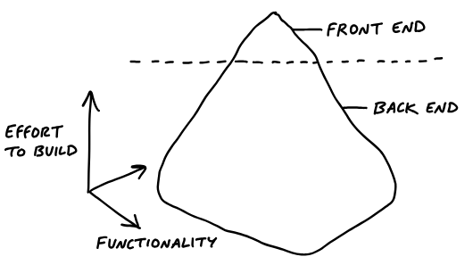

<!-- _paginate: skip -->
# **NODE Technical Book Club**

## Shape Up
##### Stop Running in Circles and Ship Work that Matters 
##### Part Three - Building
Ryan Singer

---
### Hand Over Responsibility
<!-- Now we hand over responsibility to the teams. -->
<!-- - Assign projects, not tasks -->
- Tasks for the project are decided by the team.
<!-- - Done means deployed -->
- The target is to deploy the project at the end of the cycle.
<!-- QA also happens in the cycle, but not the documentation, announcements etc. -->
---
### Kick-off
- A message with shaped project is posted.
- Then a kick-off meeting is held to walk through the project.
- First days are usually slow.
- Team discover tasks by doing real work.
<!-- - Initially team might have some imagined tasks, but real tasks are discovered when they start doing the real work. -->
---
### Get One Piece Done
- Aim to make something demoable early.
<!-- Early: In the first week or so. -->
- Integrate one slice to have a demoable product.
<!-- Case study: Clients in projects: started with visibility toggle -->
<!-- - Programmers don't need to wait ... -->
- Programmers have enough direction to start working even before there is a design thanks to shaping.
<!-- - Affordances are enough initially .... -->
- The first interface a designer can be very simple without much visual design.
<!-- - Program just enough initially .... -->
- Early back-end work also can be very simple.
---
### Map The Scopes
<!-- Previous chapter we saw they try to integrate a piece early -->
 
<!-- - Instead of creating tasks for each person(designer, programmer etc.), we should try to come up with independently intregratable scopes. -->
<!-- Initially we have only the outline shape of project -->
<!-- Then team start working on it and create tasks -->
<!-- Then they discover connections between tasks and craete scopes -->
---
Scopes become the language of the project at the macro level.
> After Bucket Access is done we can implement Invite Clients. Then we’ll Update Recording Visibility when people on the firm flip the Visibility Toggle.
<!-- Or how's Visibility Toggle going? -->
---
<!-- Scope mapping isn't planning, they are discovered while doing real work. -->
Three signs of a **good scope mapping**:
- You feel like you can see the whole project.
<!-- Nothing important is missing(hidden in details) -->
- Conversations about the project become more flowing.
<!-- Because you have the right language. -->
- When new tasks come up, you can easily see where they fit.
---
Three signs of a **bad scope mapping**:
- It's hard to say how "done" a scope is.
<!-- This happens when the tasks inside scope are unrelated -->
- The name isn't unique to the project like "front-end".
- It's too big to finish soon.
<!-- Better to break it up -->
---
### Layer Cakes

<!-- Similar amount of work in front and back end -->
Integrate all design and programmer tasks together in the same scope.

---
### Icebergs

<!-- When one of them has much more work than the other -->
It might be okay to handle UI as a seperate scope.

---
- They also have a **"Chowder"** list for loose tasks that don't fit any scope.
<!-- But be careful, if it's too big, it's a sign of bad scope mapping -->
- They mark nice-to-have tasks with **"~"**.
<!-- They don't do them unless they have time -->
---
### Show Progress

<!-- Managers don't like asking for status. It would be nice if they could see it. -->
---
- Looking at the board isn't enough.
<!-- Tasks might grow and they can be at different sizes -->
- Estimates don't show uncertainty.
<!-- 4 hour task might take 2 days -->
---
<!-- Uphill: figuirng out what to do -->
<!-- Downhill: doing it -->

Work is like a hill.
<!-- You can't make estimates until you reache the top -->
---

Much easier to understand the progress of the project.
<!-- Updated regularly -->
<!-- Also can see if there are any blockers -->
---
### Nobody says "I don't know"
- People do not like to confess they got stuck.
- This causes teams to hide uncertainty and accumulate risk.
- It can be spotted by looking at the hill chart.
<!-- When spotted you can analyze the issue and come up with a solution, like breaking up the scope etc. -->

---
### Solve In The Right Sequence
- Push the scariest work uphill first. 
<!-- It may not be possible to handle it when there is little time left (or would be much more stressful)  -->
- At the last days of the cycle, teams should have finished the important things and left with a variety of "nice-to-have" and "maybe" tasks.
---
### Decide When to Stop
- You ask yourself: Is it good enough? Is it ready to release?
- Instead of comparing up against the ideal, compare down to baseline.
<!-- Baseline: current reality for customers -->
<!-- What do they gain with this? -->
> Okay, this isn't perfect, but it definitely works and customers will feel like this is a big improvement for them
---
- Time limit forces the team to make trade-offs.
- Scope grows naturally but the team has the authority to cut it down.
- Cutting scope isn't lowering quality, it makes the product better at some things instead of others.
---
### Scope Hammering
Helpful questions for scope hammering:
- Is this a must-have?
- What happens if we don't do this?
- How likely is this case occur?
- What's the actual impact of it?
---
### QA for the Edges
- The team has the responsibility for the basic quality of their work.
- So QA can limit their attention to edge cases.
- QA generates discovered tasks that are all nice-to-haves by default.
<!-- Team decides on them -->
---
### Extension
When to extend a project?
- If the outstanding tasks are must-haves.
- If they are on the downhill.
<!-- Uphill work means unknowns so better to shape it again -->
**Extension shouldn't become a habbit.**

---
## Key concepts
- Shaped versus unshaped work
- Setting appetites instead of estimates
- Designing at the right level of abstraction
- Making bets with a capped downside (the circuit breaker)
- Choosing the right cycle length
- A cool-down period between cycles
- Breaking projects apart into scopes
- Downhill versus uphill work and communicating about unknowns

---
# Final Comments

