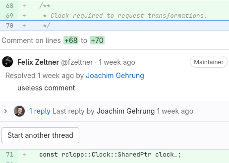
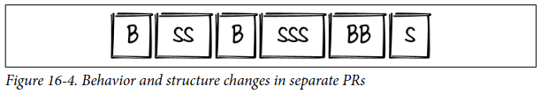
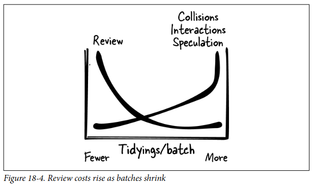
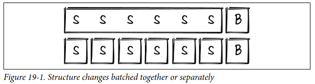

# **NODE Technical Book Club**

# Tidy First - Kent Beck

---
### Tidy First? describes:
- When to tidy messy code before changing what it computes
- How to tidy messy code safely and efficiently
- How to stop tidying messy code
- Why tidying works
---

# PART I - Tidyings

---

## Guard Clauses
From
```
if (condition)
    if (not other condition)
        ...some code...
```
To
```
if (not condition) return
if (other condition) return
...some code...
```

---

## Dead Code
#### DELETE IT!

---
## Normalize Symmetries
####  Commonize coding styles.

Example: Lazily initialized variables

```
foo()
return foo if foo not nil
foo := ...
return foo
```
```
foo()
if foo is nil
foo := ...
return foo
```

---
## New Interface, Old Implementation
#### Implement the interface you wish you could call

Similar to TDD

--- 
## Reading Order
#### Reorder the code as a reader would prefer to encounter it

---
## Cohesion Order
#### Reorder the code so the elements you need to change are adjacent

---
## Move Declaration and Initialization Together
From
```
fn()
    int a
    ...some code that doesn't use a
    a = ...
    int b
    ...some more code, maybe it uses a but doesn't use b
    b = ...a...
    ...some code that uses b
```
---
To
```
fn()
    int a = ...
    ...some code that doesn't use a
    ...some more code, maybe it uses a but doesn't use b
    int b = ...a...
    ...some code that uses b
```

---
## Explaining Variables
From
```
return new Point(
    ...big long expression...,
    ...another big long expression...
)
```
To
```
x := ...big long expression...
y := ...another big long expression...
return new Point(x, y)
```
---
## Explaining Constants
#### Name the magic numbers
```
PAGE_NOT_FOUND := 404
if response.code = PAGE_NOT_FOUND
...blah blah blah...
```
---
## Explicit Parameters
Make the parameters explicit by splitting functions:
```
function foo(params)
    foo_body(params.a, params.b)

function foo_body(a, b)
    ...a... ...b...
```
---
## Chunk Statements
#### Put a blank line between parts of the code

--- 
## Extract Helper
From
```
routine()
...stuff that stays the same...
...stuff that needs to change...
...stuff that stays the same...
```
---
To
```
helper()
    ...stuff that needs to change...

routine()
    ...stuff that stays the same...
    helper()
    ...stuff that stays the same...
```
---
Also if you see following frequently:
```
foo.a()
foo.b()
```
Then, create:
```
ab()
    a()
    b()
``` 
---
## One Pile
When tidying went wrong and ended up too many small pieces with symptoms:
- Long, repeated argument lists
- Repeated code, especially repeated conditionals
- Poor naming of helper routines
- Shared mutable data structures
#### To regain clarity, the code must first be mooshed together so new, easier-to-understand parts can then be extracted.
---
## Explaining Comments
You know that moment when you’re reading some code and you say, “Oh, so that’s what’s going on!” That’s a valuable moment. Record it.

#### Help future yourself and explain what isn't obvious from the code.

---
## Delete Redundant Comments


---
# PART II - Managing
---
- When do you start tidying?
- When do you stop tidying?
- How do you combine tidying, changing the structure of the code, with changing the behavior of the system?
---
## Separate Tidying
#### Tidyings should go in their own PRs, with as few tidyings per PR as possible


---
## Chaining
Each tidying move creates possibilities for tidying further. 
#### Flow tidyings together to achieve larger changes to the structure of your code

---
## Batch Sizes


---
## Rhytm


How much time is represented in one of those successions of structure changes followed by a behavior change?

---
## Getting Untangled
#### What to do when you have a mess of tidyings and changes all tangled together? 
--- 
Options:
- Ship it as is. This is impolite to reviewers and prone to errors, but it’s quick.
- Untangle the tidyings and changes into separate PRs, or a sequence of PRs, or a sequence of commits in a single PR. This is more polite, but it can be a lot of work.
- Discard your work in progress and start over, tidying first. This is more work, but it leaves a coherent chain of commits.
---
## First, After, Later, Never
#### What should be the timing of tidying with respect to a behavior change?
- Never: is acceptable if the code is not going to need behavior changes at all.
- Later: is good when you have a big batch of tidying but no immediate payoff.
- After: is good if you will need to change same code again soon or it is easier to do than later.
---
#### Should you Tidy First as the title of the book suggests? 
IT DEPENDS.
Do it when:
- It will pay off immediately, either in improved comprehension or in cheaper
behavior changes.
- You know what to tidy and how. 
---
# See you in 
# Part III - Theory
# discussion

