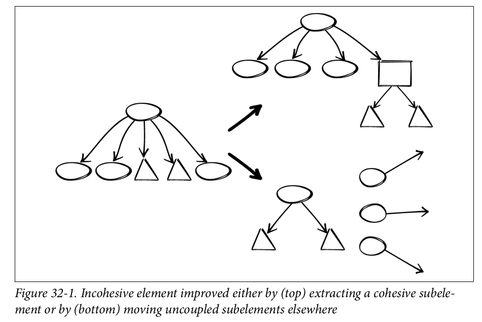

# **NODE Technical Book Club**

# Tidy First Part III - Kent Beck

---

# PART III - Theory

- What is software desing?
- How does software design and cost of the software development and operation drive each other?
- What are the trade-offs for investing in tidying or not?
- What economic and human principles can we use to decide whether and how to tidy?
---
## Benefically Relating Elements
* Elements: Substantial structures with parts
* Relating: Elements exist in relation to each other.
  - Invoking, publishing, listening, referring
* Benefically: Design enhances benefits through relationships.

---
Software designers beneficially relate elements. They can only:
- Create and delete elements
- Create and delete relationships
- Increase the benefit of a relationship
---
From
```
caller()
return box.width() * box.height() 
```
To
```
caller()
    return box.area()   
Box>>area()
    return width() * height()
```
---
## Structure And Behavior
Software creates value in two ways:
- Behavior: What it does today 
- Options: The possibility of new things we can make it do tomorrow
---
- Behavior creates value but not forever. It needs to adapt to changing user needs or technological advancements.
- Options are the economic magic of software.
- Structure of a software determines its options.
- Assessing structure changes is hard
---
## Economics: Time Value and Optionality
- A dollar today is worth more than a dolar tomorrow.
- In a chaotic situation options are better than things.
---
## A Dollar Today > A Dollar Tomorrow
- You can't spend it now.
- Tomorrow can not be trusted.
* This encourages tidy after over tidy first.

---
## Options
- "What behavior can I implement next?" has value on its own.
- It is more valuable the more behaviors are in the porfolio.
- Don't care which item will be most valuable and keep open the option.
- The more uncertatin the predictions of value are, the greater the value of option is.
---
Financial options have these parameters:
• The underlying thing that we can buy
• The price of the underlying, including the volatility of that price
• The premium of the option, or the price we pay today
• The duration of the option, or how long we have to decide whether to purchase
the underlying

Design we do today is the premium we pay for the “option” of “buying” the
behavior change tomorrow.

---
## Options Versus Cash Flows
* Discounted cash flow suggests "Don't tidy first"
* Options suggests "Absolutely tidy first"
* Tidy first for sure if 
  - cost(tidying) + cost(behavior change after tidying) < cost(behavior change without tidying)
- What to do when
  - cost(tidying) + cost(behavior change after tidying) > cost(behavior change without tidying)

---
## Reversible Structure Changes
- Structure changes are much easier to revert than behavior changes.
- What can we make to behavior changes more reversible?
---
## Coupling
- Expensive programs all have one property in common: changing one element
required changing other elements.
- Coupling drives the cost of software.
- 1-N Coupling: One element can be coupled with any number of other elements with respect to a
change.
- Cascading: Once a change has rippled from one element to another.
---
## Constantine's Equivalence
- At least 70% of the software development costs are maintenance costs.
- The goal of the software design is to minimize the cost of software.
- **cost(software) ~= cost(change) ~= cost(big changes) ~= coupling**
---
## Coupling vs Decoupling
- Why we have coupling?
  * We didn't notice.
  * It was cheaper to do so.
  * It wasn't a problem until now.
  * It was inevitable.
- You’re faced with a choice today: **pay the cost of coupling or pay the cost of decoupling?**
- You can pay the cost of coupling or pay the cost (and reap the benefits) of decoupling.

---
## Cohesion
- Coupled elements should be subelements of the same containing element.
- Elements that aren’t coupled, should go elsewhere.
---



---
## Conclusion
We should decide on tidy first based on:
-  Cost—Will tidying make costs smaller, later, or less likely?
- Revenue—Will tidying make revenue larger, sooner, or more likely?
- Coupling—Will tidying make it so I need to change fewer elements?
- Cohesion—Will tidying make it so the elements I need to change are in a smaller, more concentrated scope?
---
After all always
### Leave it better than you found it